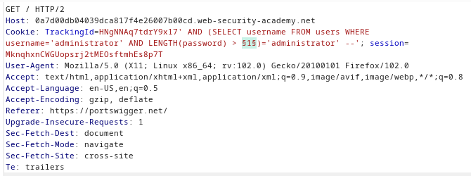
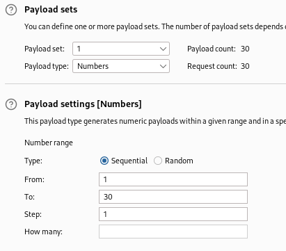
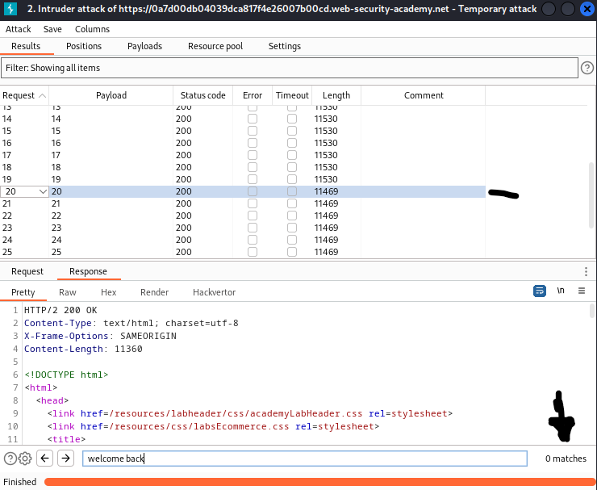
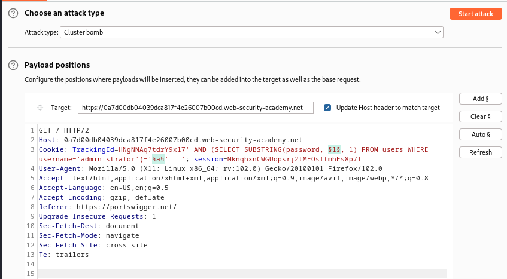
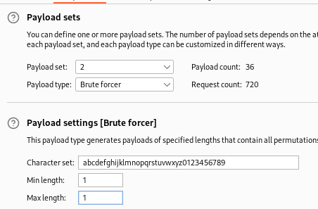

### Blind SQL injection with conditional responses : PRACTITIONER

---

The query that deals with the `TrackingId` cookie looks like this: 
```
SELECT TrackingId FROM TrackedUsers WHERE TrackingId = 'HNgNNAq7tdrY9x17'
```

We know that our `TrackingId` cookie's value exists already, so if we attempt to reload the page or visit another page on the site, it will show the 'Welcome Back' message.
- If the cookie value doesn't exist, no rows are returned, and the "Welcome Back" message is not displayed.

> Therefore, we know that the website shows 'Welcome Back' in true conditions, and doesn't in false conditions.

##### Check for Conditional Responses

To try to exploit it using SQL injections, try adding a payload that will also evaluate to true and another that will evaluate to false and check if the behavior is still the same.

Creating a True query.
```
HNgNNAq7tdrY9x17' AND 1=1 --'
```
- We see the "Welcome Back" message displayed, hence, we know that true conditions work.

Creating a False query.
```
HNgNNAq7tdrY9x17' AND 1=2 --'
```
- We don't see it, hence, we can proceed knowing that for true SQL expressions we see the welcome back message, otherwise we don't.

##### Enumeration - Username

We can use that to check if there is a users table in the database. 
- We write a query that checks if this table exists, if it does, then we will see the welcome back message.
```
HNgNNAq7tdrY9x17' AND (SELECT 'x' FROM users LIMIT 1)='x' --'
```

> As the welcome back text is produced, then we know that this table exists.

 We now need to enumerate for the administrator.
```
HNgNNAq7tdrY9x17' AND (SELECT username FROM users WHERE username='administrator')='administrator' --'
```
- What this query does is that selects a user from the users table whose username is administrator. If it exists, it will return it, and since we are comparing with `administrator`, the condition will evaluate to True, and we can use the "Welcome Back" message to deduce that.

> Since the "welcome back" message was returned, then we know that the username 'administrator' exists for the admin user.

##### Enumeration - Password

First, we enumerate the password length.
```
HNgNNAq7tdrY9x17' AND (SELECT username FROM users WHERE username='administrator' AND LENGTH(password) > 1 )='administrator' --'
```

We know from the previous query that the administrator username exists, so we can compound in it another AND expression to check for the length of the password.
- Keep adding in the length until we don't receive the "welcome back" message, and by then we will know the length of the password.

> Or, instead of doing it manually, we can do it via BURPSUITE INTRUDER sniper attack. Put the placeholders at the length and keep sending requests until the right length is received.



We then set the payload to be simply decimals from 1 to a large number.



Then we start the attack and observe the different results. 



We can use the length of the request and see that for a request with the "welcome back" message produced it is of size 11530, but for one without the message it is 11469.

> Check the first instance of 11469, and see that it is the size of our password as we used the `>` operator.

Now that we know our password has a length of 20, we can now enumerate the letters of that password. 
- We can do this query on each position in the password and for each alphanumeric character until we get all the responses with the welcome back message.
```
HNgNNAq7tdrY9x17' AND (SELECT SUBSTRING(password, 1, 1) FROM users WHERE username='administrator')='a' --'
```

> Check for the first character of the password if it is 'a' or not. If we get a welcome back message then it is a and we move on to the next character.
> If we don't get the welcome back message, then we try the next character.

This attack can be done using BURPSUITE INTRUDER clusterbomb attack.
- Set the different payload positions to the index in the password and the letter at that index.



The first payload being the index will be the numbers list from 1 to 20.

The second payload being the character will be the alphanumeric list containing a-z and 0-9.



Start the attack, and check the lengths as done above. 
- Combine the letters at the different positions and then login as administrator to complete the lab.

1 - v
2 - t
3 - p
4 - g
5 - w
6 - 4
7 - u
8 - g
9 - v
10 - v
11 - u
12 - r
13 - m
14 - c
15 - x
16 - n
17 - q
18 - s
19 - c
20 - 9

---
