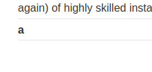

### SQL injection attack, querying the database type and version on Oracle : PRACTITIONER

---

> Category parameter is vulnerable to sql injection. 
> First thing to do is get the number of columns. This is an oracle database, so must add `FROM DUAL` at the end of the query.
```
' UNION SELECT NULL, NULL FROM DUAL--
```
> The query has 2 output columns.

> Find out the column data types, and we need text to display the banner of the database.
```
' UNION SELECT 'a', NULl FROM DUAL--
```



> We see that it doesn't produce an error and outputs the letter `a` confirming that this column is of type text.
> We can use the first column to display the database version.

> Change the first column to display the banner of the oracle database as requested, and change the table to `v$version`.
```
' UNION SELECT BANNER, NULL FROM v$version--
```

> Pressing enter, we see the output of the page also shows the database banner and version.

---
