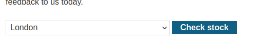
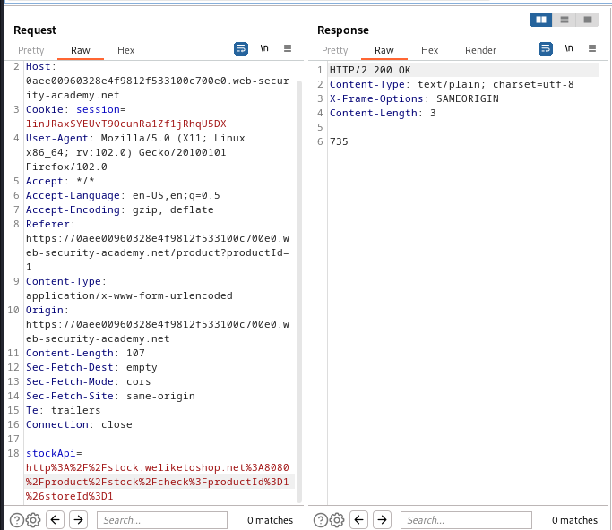

### Basic SSRF against the local server : APPRENTICE

---


> We visit any item and check its stock with BURPSUITE PROXY HTTP history on.



> There is a `POST` request sent.



> We see there is a parameter at the bottom that contains a link.
> This link is sent from the server (backend) to an API.
> If we modify this link to make it seem as if it originates from the server itself, it will be trusted.
> We can then use it to access unauthorized pages such as `/admin`.

> We change the value of the `stockApi` parameter.
```
stockApi=http://localhost/admin
```
> This will become URL encoded in BURPSUITE Repeater.

> Sending the request, we see that we are greeted with the admin page.


> We now need to delete the user carlos.
> Showing this response in browser and trying to delete carlos doesn't work.


> Since our request originates from us, and not from the localhost, the delete admin functionality fails.

> We can instead supply in the `stockApi` parameter itself the delete for carlos.
> To do that, we need to find out the URL of the delete functionality, as well as supply the user `carlos` as a parameter.

> Using the show response in browser, we right click on `delete carlos` and inspect its source code.


> So if we modify our `stockApi` parameter to include that URL, we can then send the request from localhost and bypass access control.
```
stockApi=http://localhost/admin/delete?username=carlos
```
> Making sure the value is url encoded.

> Sending the request completes the lab.

---
