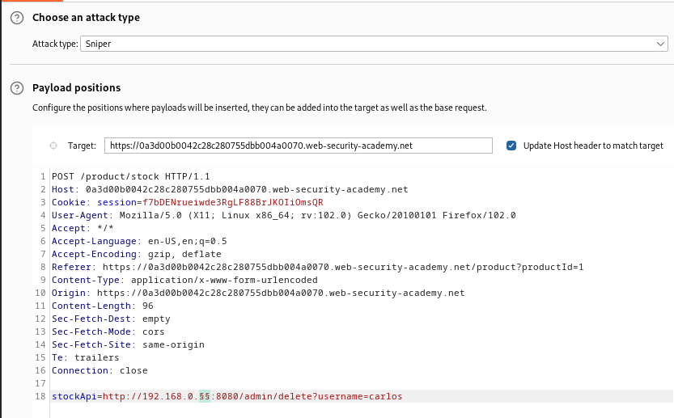
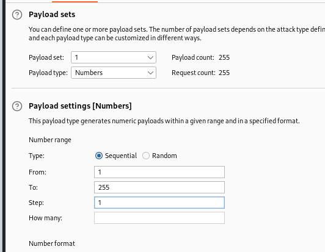
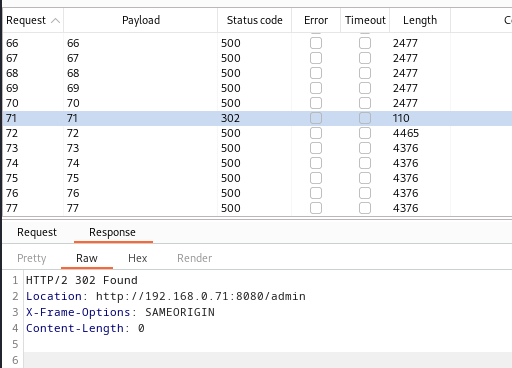

### Basic SSRF against another back-end system : APPRENTICE

---

> We visit any item and check its stock with BURPSUITE PROXY HTTP history on.


> There is a `POST` request sent.


> We see there is a parameter at the bottom that contains a link.
> This link is sent from the server (backend) to an API.
> This link is trusted, so if we try to access some backend system through this parameter, we will probably succeed.

> Modifying the URL in the `stockApi` parameter and sending it to BURPSUITE INTRUDER to cover the entire range.
```
stockApi=http://192.168.0.1:8080/admin/delete?username=carlos
```
> Similar to [[Portswigger/SSRF/Lab 1|Lab 1]], we add the delete and username to perform the action of deleting the user from within the same request.

> We then send it to to intruder for a sniper attack, and add the payload in the last number in the IP address to scan the range.



> For the payload, it will be a list of numbers from 1 to 255.



> Start the attack.
> We see all 500 codes, meaning the page we are trying to reach doesn't exist.
> There is only response with 302, meaning the page we wanted was found and the action was complete.



> We see the lab is complete.

---
