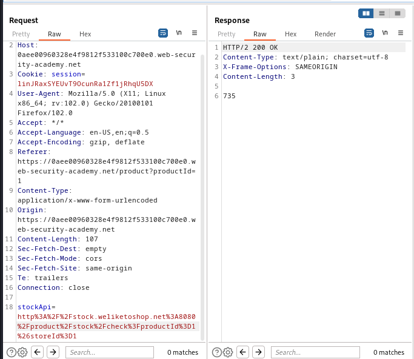
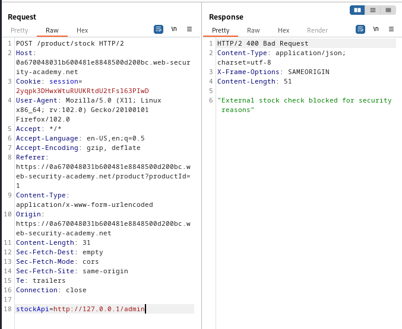
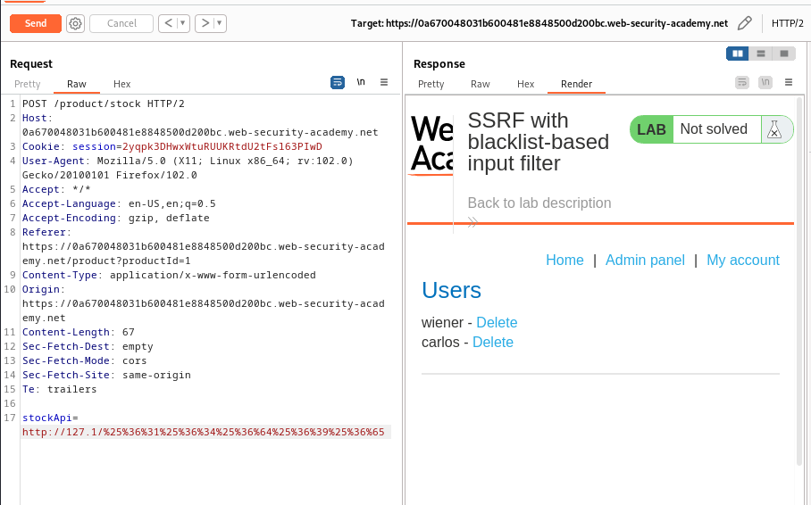
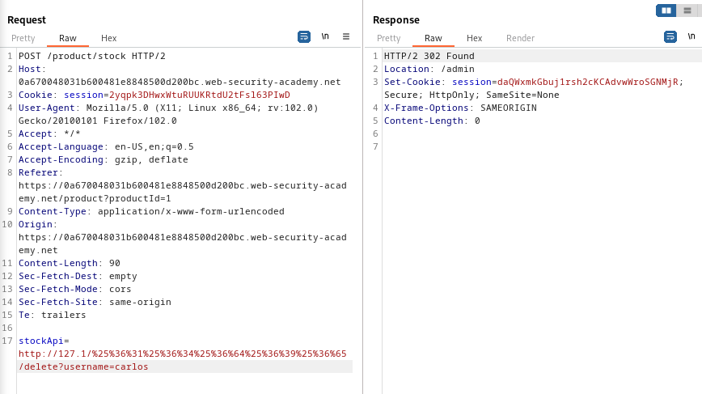

### SSRF with blacklist-based input filter : PRACTITIONER

---


> We visit any item and check its stock with BURPSUITE PROXY HTTP history on.


> There is a `POST` request sent.



> Trying to modify the `stockApi` parameter URL to access the `/admin` page.
> Trying the normal payload.
```
http://127.0.0.1/admin
```



> We see that it is blocked.
> Changing the `127.0.0.1` to another representation of this IP address.
```
http://127.1/admin
```

> We see that is is also blocked.
> Maybe the issue is with accessing the `/admin` page itself.
> Trying to URL encode the `/admin` path.
```
http://127.1/%61%64%6d%69%6e
```

> It also doesn't work. Trying to double URL encode it.
```
http://127.1/%25%36%31%25%36%34%25%36%64%25%36%39%25%36%65
```

> Now it is sent to the server encoded once, so it can bypass the black-list.



> We now have access to admin page.
> Similar to [[Portswigger/SSRF/Lab 1|Lab 1]], we enter the delete page and the username parameter with carlos.
```
http://127.1/%25%36%31%25%36%34%25%36%64%25%36%39%25%36%65/delete?username=carlos
```

> Sending the request completes the lab.



> A better way was to first bypass the `127.0.0.1`, and then bypass the encoding of the `/admin` page, and not do both at the same time.

---

