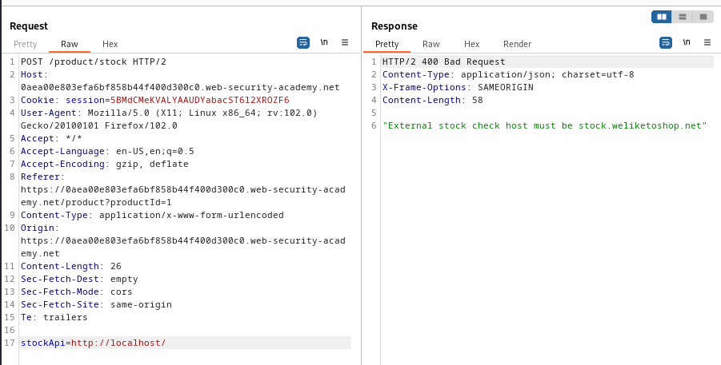
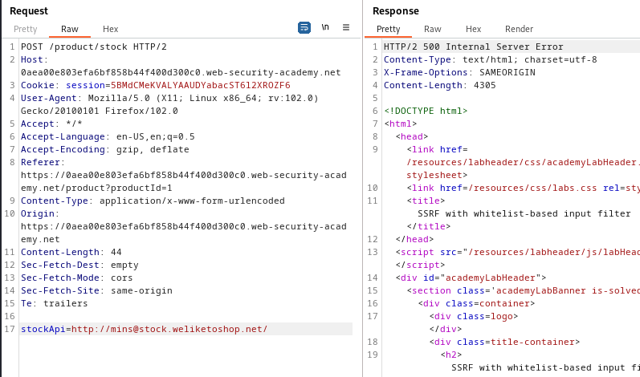
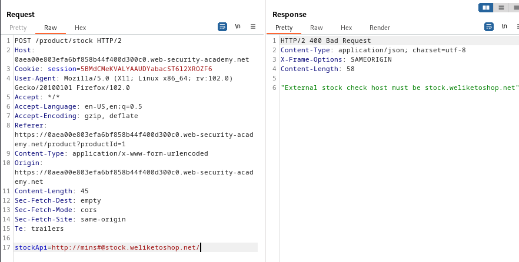
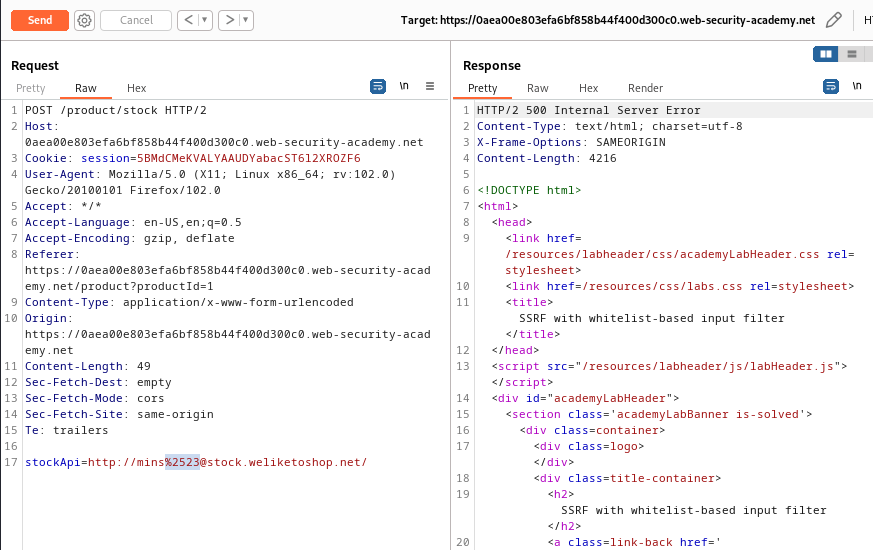
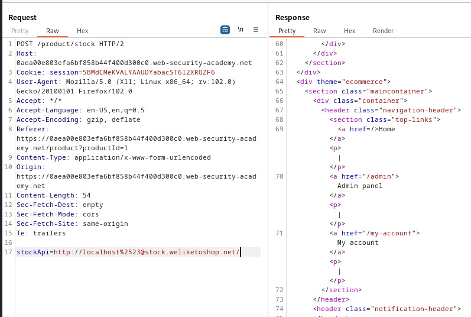

### SSRF with whitelist-based input filter : EXPERT

---


> We visit any item and check its stock with BURPSUITE PROXY HTTP history on.


> There is a `POST` request sent.


> Trying to modify the `stockApi` parameter URL to access the `/admin` page.
> Trying the normal payload.
```
http://127.0.0.1/
```



> We see that the URL must include the host `stock.weliketoshop.net`.
> So we try to play with the URL parser that takes as input the URL.

> We try adding user credentials to see if the URL parser takes what's on the left of the `@` sign.
```
http://mins@stock.weliketoshop.net/
```



> We see that we bypassed the input filter.
> Now, we need to try and see if the URL is trying to access the part we place before the `@`. If it does, we can place `localhost` instead of `mins` and access the page from the server.

> To do that, we must place the `#` character.
```
http://mins#@stock.weliketoshop.net/
```

> Sending this request returns an error from the URL parser side, meaning we didn't pass it yet.



> Trying to encode the `#` gets the same error.
> Double encoding the `#` character works, and we pass the URL parser.
```
http://mins%2523@stock.weliketoshop.net/
```



> Now, we know that the website is trying to access `mins`.
> If we change it to `localhost`.
```
http://localhost%2523@stock.weliketoshop.net/
```



> We see that we access the page from the server side, and we are given the admin panel.
> Similar to [[Portswigger/SSRF/Lab 1|Lab 1]], change the URL to delete carlos and complete the lab.

```
http://localhost%2523@stock.weliketoshop.net/admin/delete?username=carlos
```

---
