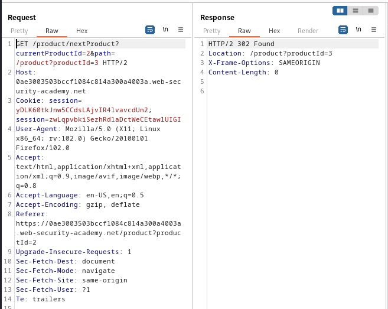

### SSRF with filter bypass via open redirection vulnerability : PRACTITIONER

---


We visit any item and check its stock with BURPSUITE PROXY HTTP history on.


There is a `POST` request sent.


> If we try modifying the `stockApi` parameter to anything, it doesn't work.

> Clicking on the `next product` button while having BURPSUITE PROXY HTTP history on.


We see there is a `GET` request sent to fetch the next page.



> There is a parameter `path` that fetches the pages. If we follow the redirection from this request, we are met with the page with the path present in the `path` parameter.


We will try to play with the value of the `path` parameter and see if it can fetch an arbitrary URL.
```
path=https://www.googe.com/
```

> We see that it works.

So if we modify our `stockApi` parameter to fetch a page using the path we supply by using the path present in the `GET` request that has the `path` parameter present.
```
stockApi=/product/nextProduct?currentProductId=2&path=https://www.google.com/
```

Instead of google, we now add the page we need to visit.
```
stockApi=/product/nextProduct?currentProductId=2&path=http://192.168.0.12:8080/admin
```

> After URL encoding the value of the parameter, we send the request and see that we are redirected to the admin page.


> Similar to [[Portswigger/SSRF/Lab 1|Lab 1]], change the URL to delete carlos and complete the lab.
```
stockApi=/product/nextProduct?currentProductId=2&path=http://192.168.0.12:8080/admin/delete?username=carlos
```
> URL encode it then send.

---
