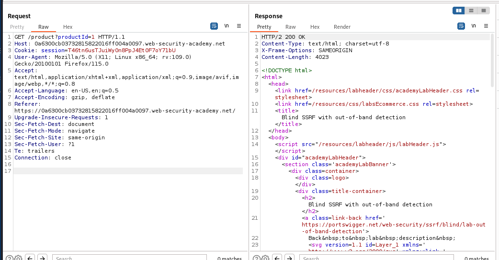
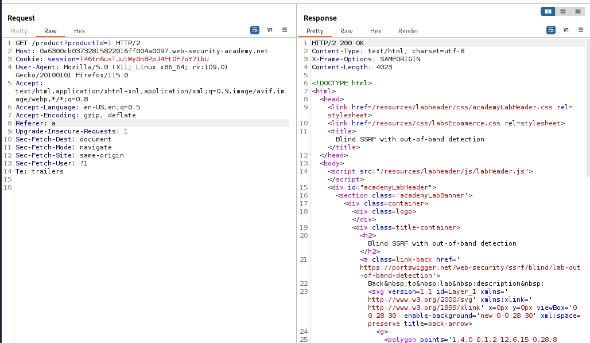

### Blind SSRF with out-of-band detection: PRACTITIONER

---

According to the lab description, the URL present in the `referer` header is fetched when a product is loaded, therefore, this is most probably the location where the SSRF payload will be placed.

> First thing to do, is open any product page and have BUPRSUITE HTTP HISTORY open.

This is the request we will be playing with, and mainly by changing the value of the `referer` header.
- Since we know this is a blind lab, then injecting anything right now will not result in any difference in the response we see.

> Using BURPSUITE REPEATER, we see that by writing an invalid URL, nothing changes in the response.

Now, to detect blind vulnerabilities, we can use the COLLABORATOR server.
- Right clicking on the value of the `referer` header field, and then pressing on `insert collaborator payload` will place the URL of the server.

> Sending this request and then opening the collaborator tab will show us some requests being made. 
> These requests are coming from the backend server that tried to fetch the collaborator server domain, hence, completing the lab.

---

