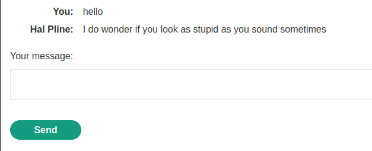

### Manipulating WebSocket messages to exploit vulnerabilities : APPRENTICE

---

> Heading to the Live Chat page while having BURPSUITE PROXY HTTP history on.


> We see the headers that are in place that initiate a websocket connection.
> Therefore, we are now going to use the WebSockets History tab in BurpSuite while using the chat feature.

> Sending `Hello` in the chat.


> We see the message sent to the server, and then in message number 8, we see the message sent back to us again.


> This is used to display the message we sent on the screen.



> The data is sent in a JSON format, so we can try to put our payload that calls the `alert()` function in the message.

```

```

> Sending that via the chat feature, nothing happens.
> We see that the angle brackets and qoutes are encoded.


> So we try to intercept the message being sent using proxy, and changing it there.


> Changing it to our payload.


> Forwarding all the remaining requests, we see the alert pop up.


##### Note

> I tried sending the normal payload.
```
<script>alert(1)</script>
```
> But the server replies with:
```
<script>alert(1)<\/script>
```
> I think that breaks out of the script, not making it work.

---
