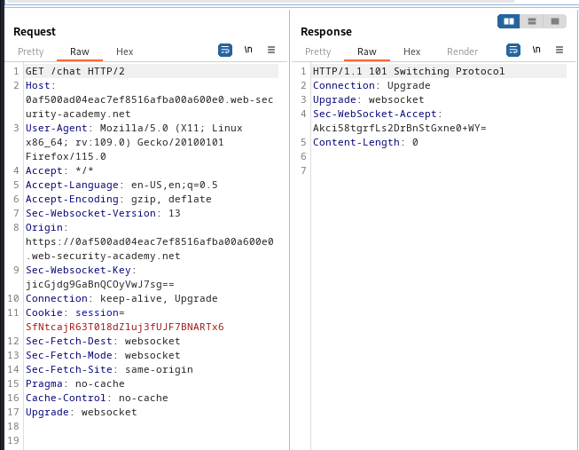
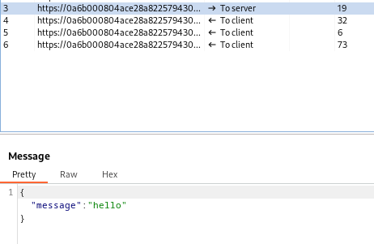
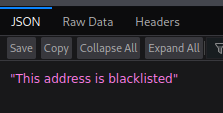
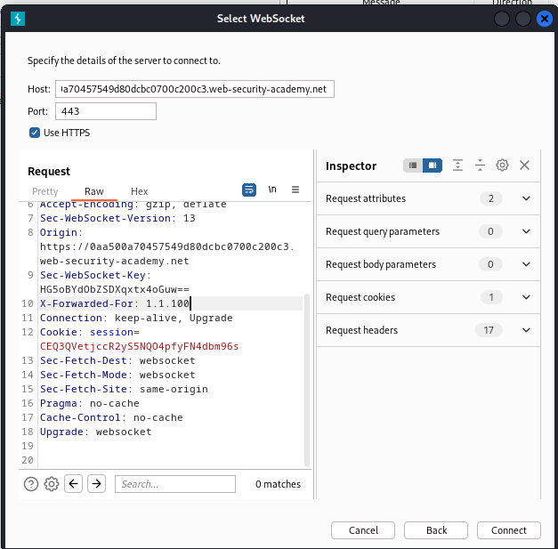
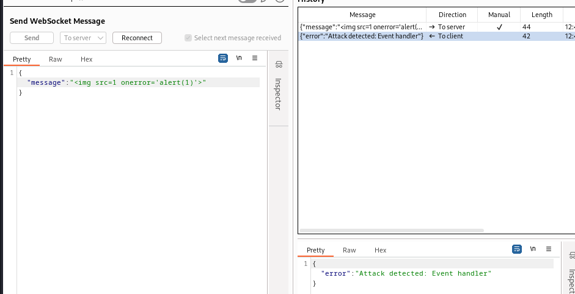
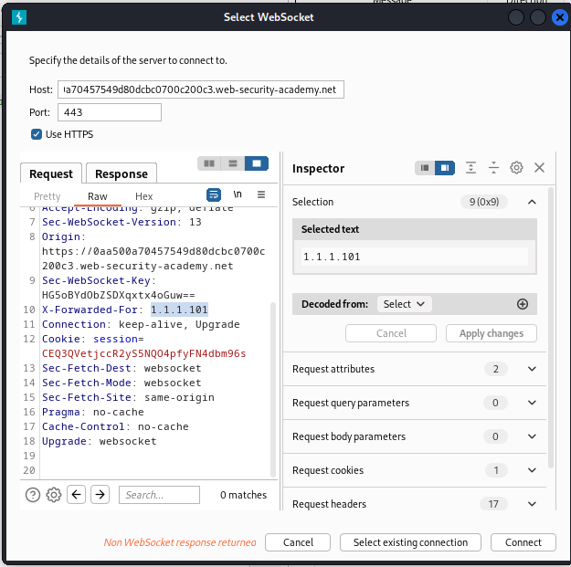

### Manipulating the WebSocket handshake to exploit vulnerabilities : PRACTITIONER

---


> Heading to the Live Chat page while having BURPSUITE PROXY HTTP history on.



> We see the headers that are in place that initiate a websocket connection.
> Therefore, we are now going to use the WebSockets History tab in BurpSuite while using the chat feature.

> Sending messages in the chat logs in the WebSocket history tab the messages between client and server.
> They are in JSON format.



> Now, we need to trigger the alert function.
> Similar to [[Portswigger/WebSockets/Lab 1|Lab 1]], we need to intercept a message being sent in the proxy, modify its contents, and then forward it.

```

```

> Once we forward, the chat disconnects.
> Refreshing the page, we see this error:



> We need to change the IP address of the request using headers.
> Do that using the `X-Forwarded-For` header with an IP address.

> We go to WebSocket History and send one of the messages to repeater.


> In repeater, we need to reconnect to the websocket.
> To do that, we need to bypass the IP address blacklist.
> Add the `X-Forwarded-Header: 1.1.1.100` HTTP header and then try to connect.



> We see that we connected.
> Trying the same payload again.



> We see that it detects the attack, and disconnects us.
> Trying to reconnect again doesn't work as we are using the same IP address in the `X-Forwarded-For` header.
> Change the value of the header and reconnect.



> Now that we are connected, we need to obfuscate our XSS attack so that we aren't blocked again.
> Using the [XSS Cheat Sheet](https://portswigger.net/web-security/cross-site-scripting/cheat-sheet), heading to the `WAF bypass global objects` section.

```
';window['ale'+'rt'](window['doc'+'ument']['dom'+'ain']);//
```

> Pasting that payload into the message and sending the request we see we are not blocked, meaning the attack worked.

---
