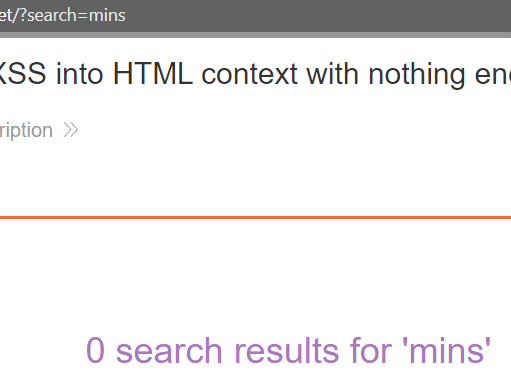

### Reflected XSS into HTML context with nothing encoded : APPRENTICE

---


> Realize that there is an injection point in the search bar, because once i submit my search, it is displayed as data in the immediate response in the browser.



> Try injecting the XSS payload
```
<script>alert()</script>
```
> And the website responds with a pop-up window, informing me that it is vulnerable to reflected XSS.

---
