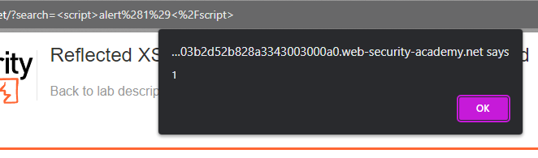

### Reflected XSS into HTML context with nothing encoded : APPRENTICE

---


Realize that there is an injection point in the search bar. 
- This is because once I submit my search, it is displayed as data in the immediate response in the browser.


Try adding this payload into the search bar.
```
<script>alert(1)</script>
```

> And the website responds with a pop-up window, hence, it is vulnerable to reflected XSS.



---
