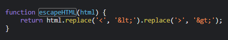
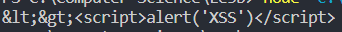

### Stored DOM XSS : PRACTITIONER

---

> Send a request and see that there is a file called `loadCommentsWithVulnerableEscapeHTML.js` that contains the script that handles the comment section.

> See that the function that handles any form of input validation is the `escapeHTML()` function.



> What this does is that takes only the first `<` and `>` characters and replaces them. Any other characters are left as is.
> This allows us to simply craft this payload:
```
<><script>alert('XSS')</script>
```

> This will look like this after the encoding.



> Inserting this payload in the comment section doesn't work.
> Trying a more powerful payload.
```
<>
```
> The alert pop-up shows, and the lab is complete.

---
