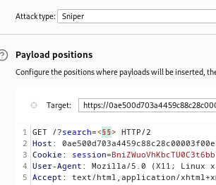

### Reflected XSS into HTML context with most tags and attributes blocked : PRACTITIONER

---

Try in the search bar the payload
```

```
- But we get a 400 response and a response saying `invalid tag`.


> To try and find the right tag, use the BURPSUITE INTRUDER sniper attack. Use the [XSS Cheat Sheet](https://portswigger.net/web-security/cross-site-scripting/cheat-sheet) tags and copy the tags to clipboard.

Send the GET request with the search parameter to intruder, and set the positions of the placeholders within the `<>` brackets in the search parameter.
- Then in the payloads, paste the copied tags, and start the attack.




> Observe that almost all tags return a 400 response code, but only one tag, `body` responds with a 200 OK code.

Now that we have the tag ready, `body`.
- We have a partial payload to use.
- Need to find an event that gets a 200 response via the same technique.
```
<body //event>
```

> This time, the placeholders of the sniper attack will be in the event attribute.


These events responded with 200, while all the others responded with a 400 code.


Choose to work with the `onresize` attribute.

> Since the lab requires that there is no user input, we need to automatically change the size of the window so that the event `onresize` is called and then we can insert the `alert` or `print` function.

The normal payload
```
<body onresize=print()>
```

> To make it without user input and store it on the website, we need to use the server and use an `iframe` element that we can play with with the same URL as the lab.

This element will have the `src` attribute set to the lab UEL, along with the search parameter set to the payload above.
- Moreover, we will include an attribute that automatically changes the size of the window such that the `onresize` attribute is called and our payload executes automatically.
```
<iframe src ="https://0ae500d703a4459c88c28c00003f00eb.web-security-academy.net/?search=<body+onresize=print()>" onload=this.style.height='200px' ></iframe>
```

Deliver the exploit to victim, and complete the lab.

---
