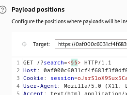

### Reflected XSS with event handlers and href attributes blocked : EXPERT

---

> We first need to find the whitelisted tags using BURPSUITE INTRUDER spider attack, and for the payload paste the tags from the XSS cheat sheet.



> See those tags that are available that have a 200 OK response.
> These are:
* `svg`
* `a`
* `title`
* `animate`

> The only way to insert JS code is via the `href` in the `a` or using evets, but both ways are blocked.

> Use the `svg` tag to include other tags inside.
> Inside, include the `a` tag to create a link for the `click` functionality.
> Then, add the `animate` tag, and include its 2 attributes `attributeName` and `values`.

```
<svg> 
<a>
<animate attributeName='href' values='javascript:alert(1)'></animate>
<text x='10' y='10'> Click </text>
</a>
</svg>
```
> The `attributeName` attribute allows us to use any attribute and name it, and give its value in the `values` attribute. So we used the `href` attributes, and added javascript code to `alert` in the values.
> We also added the `text` element to hold the `click` text, and we must add x and y coordinates for this element, so we added any values.

---

