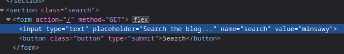
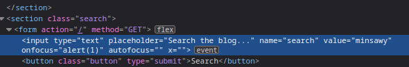

### Reflected XSS into attribute with angle brackets HTML-encoded : APPRENTICE

---

> Write `Minsawy` and check where it appears in the source code.



> Here, our value is placed inside an attribute.
> We can break out of that attribute, add a new attribute and insert our payload there.
```
minsawy" onfocus=alert(1) autofocus x="
```
> What this does is that it breaks out of the attribute, and adds the attribute event onfocus that is triggered via the autofocus attribute.
> It then closes off the remainder of the tag and exits.



> Place that into the search bar and enter to see the pop-up and complete the lab.

---
