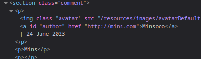
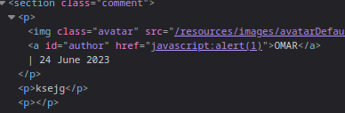

### Stored XSS into anchor href attribute with double quotes HTML-encoded : APPRENTICE

---

Enter dummy values and check where they are placed within the source code.



> See that the website is put into the `href` attribute, which we can control.

Try entering the payload that executes JavaScript code automatically into the website section of the comment.
```
javascript:alert(1)
```



Submit the comment and go back to click on the author to see the pop up and complete the lab.

---
