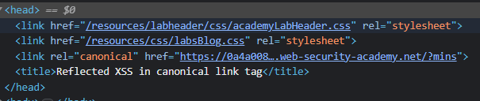
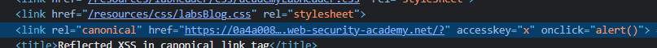

### Reflected XSS in canonical link tag : PRACTITIONER

---

See that the URL of the page is directly accessed and changed via user input.



> We add a payload to include the letter we will use in combination with the `ALT` and `SHIFT` keys to trigger the event. This event will be the `onclick` event, and its function will be `alert()`.

The payload needs to close of the quotes and then insert our `accesskey` and `onclick` attributes.
```
'accesskey='x'onclick='alert()
```
- This closes of the `href`, then adds a new attribute `accesskey` with value `x`.



Once `x` is pressed with `alt` and `shift`, or `alt` alone, the `onclick` event is triggered and the alert pops up, completing the lab.

---
