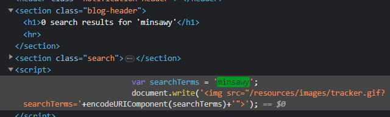
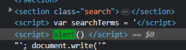

### Reflected XSS into a JavaScript string with single quote and backslash escaped : PRACTITIONER

---

Entering `minsawy` and seeing where it appears in the code.




We see that our term is placed into a string.
- Try breaking out of the string using the quote backslash technique
```
mins\'; alert();
```

> But it escapes out of it and adds another `\` to cancel our payload.

- Try another technique to insert a `</script>` tag to close off the script, and then add a new `<script>` tag with the payload.
```
</script> <script> alert() </script>
```



Now there is simply a new script with the alert function, and the browser executes it, and it pops up completing the lab.

---
