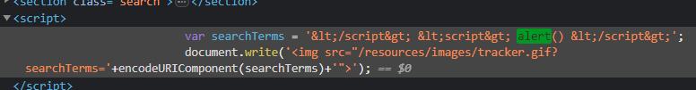
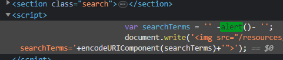

### Reflected XSS into a JavaScript string with angle brackets HTML encoded : APPRENTICE

---

Similar to [[Portswigger/XSS/Lab 18]] in the source code, i tried the same payload
```
</script> <script> alert() </script>
```
- It didn't work, and that was because the angle brackets are all encoded.



> This means we have to break out of the string to be able to insert our payload.

Trying this payload.
```
' -alert()- '
```
- It works, but it wouldn't have worked if the `'` character had an escaping security mechanism in place by the website.



> The pop up works and the lab is complete.

---
