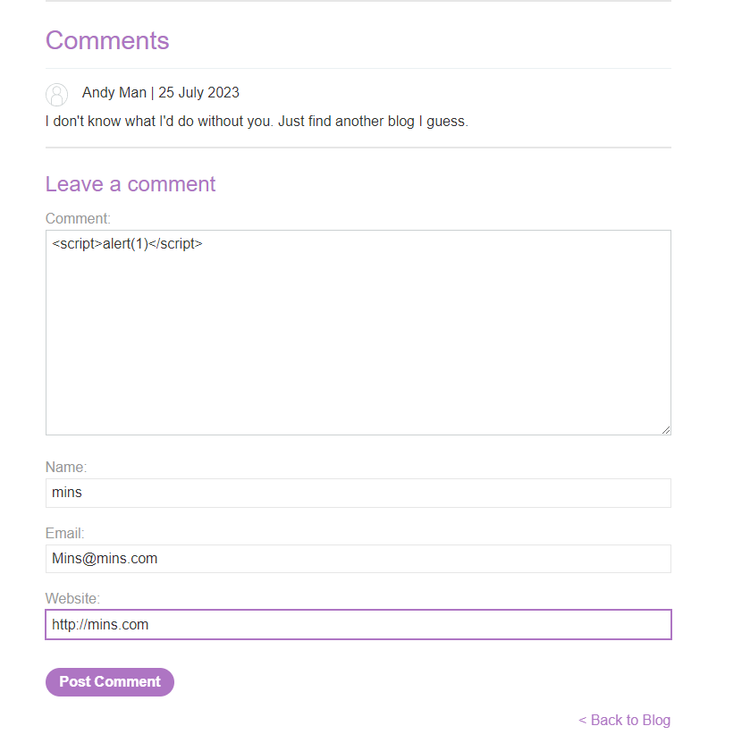
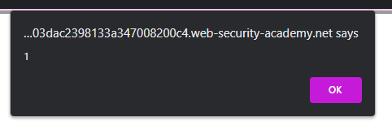

### Stored XSS into HTML context with nothing encoded : APPRENTICE

---

We need to look for stored content that gets fetched.
- We see that if we view a post, there are comments.



> We try leaving a comment, and insert a payload to display the pop up.

```HTML
<script>alert(1)</script>
```

Posting the comment, we see that every time we visit the same page, we get a pop up.
- Hence, this is a stored XSS attack.



---
