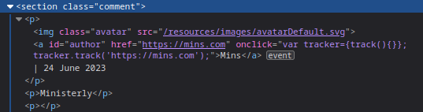
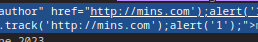

### Stored XSS into onclick event with angle brackets and double quotes HTML-encoded and single quotes and backslash escaped : PRACTITIONER

---

> After entering some dummy data, i saw the code where the comment lies. 
> Moreover, clicking on the author name takes us to the website using the `onclick` event attribute.



> Our input gets placed in the `.track();` area.
> We need to exit out of that function, and add our own `alert` paylod.
> We will stay within the `onclick` attribute. 

> Take the POST request to BURPSUITE REPEATER and keep altering the website parameter's value in the body of the request.

> We need to add a qoute to exit the string. To add a qoute, either use `&apos;` in HTML entity encoding or `#&x27` for hex encoding.
```
&website=http://mins.com&apos;
```
> We need to URL encode this for it to work, so selecting it and hitting `CTRL + U`.
```
&website=http%3A%2F%2Fmins.com%26apos%3b
```


> Now we see that in the code, we have added an extra qoute. But we have an qoute, bracket, semicolon, and double qoutes.
> We can use the latter qoute and the bracket afterwards to close off our alert() function.
> Moreover, we can exit the track function by adding `);` after the qoute we inserted.
```
&website=http://mins.com&apos;);alert(&apos;1
```

> Encoding our payload.
```
&website=http%3a//mins.com%26apos%3b)%3balert(%26apos%3b1
```

> This results in.



> We have exited the brackets and the string via using the qoute HTML encoding.
> Clicking on the author name will take us to a wrong link with no page, but the lab is complete.


> Test it via the console.log(1) feature and see that once we click, it logs.
> Turn on persistent logs from the settings to see logs even after being redirected.


---
