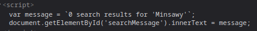

### Reflected XSS into a template literal with angle brackets, single, double quotes, backslash and backticks Unicode-escaped : PRACTITIONER

---

> Try inputting `Minsawy` and see where it occurs in the code.
 
 

> This is a JavaScript string literals, and to execute payloads inside them, we can use the `${}` technique.
```
${ alert(1) }
```

> Putting that payload in the search bar completes the lab as the pop up shows.

---
