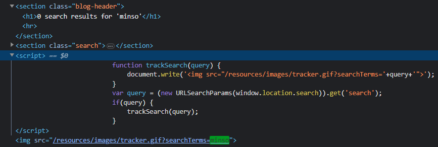
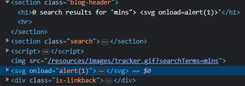

### # DOM XSS in document.write sink using source location.search : APPRENTICE

---

> Enter `minso` and check where it appears in the DOM through developer tools.

> See that it appears twice, once in the `h1` tag, which is the HTTP response.
> And the other time in some JavaScript code. This is where the attack will happen.



> The javascript code takes the entry in the search bar called query, and calls the function `trackSearch`.
> This function then writes to the DOM an img element, and its source attribute's contains a path.
> The end of the path contains the search item minso.

> Will try to break out of the `img src` element attribute, and add a new element or tag with the XSS payload.
```
mins"> <svg onload=alert(1)>
```
> So what happens is that the qoute and angle bracket close off the src img, and we add a new element with the onload attribute that calls the payload.



---
