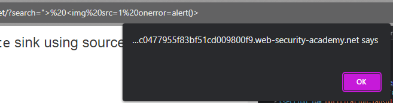
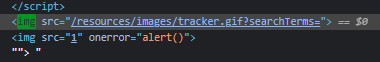

### DOM XSS in document.write sink using source location.search : APPRENTICE

---

Enter `minso` and check where it appears in the DOM through developer tools, source code.

See that it appears twice
- Once in the `h1` tag, which is the HTTP response.
- And the other time in some JavaScript code. This is where the attack will happen.


The JavaScript code takes the entry in the search bar called query, and calls the function `trackSearch`.
- This function then writes to the DOM an `img` element, and the `src` attribute of that image includes the user input `query`.

> There is a *source*, which is the URL `searchTerms` query parameter that we can change, and then there is the *sink*, which is `document.write`. There is a taint flow, and we can exploit a DOM based vulnerability.

Since the sink simply adds a new HTML element, we can try to break out of the `img` element's `src` attribute, and add our XSS payload.
```
"> 
```

> Entering this payload in the URL in the `search` query parameter and hitting enter, we see the alert pop-up.



We also see how this payload changed the DOM:
- We closed off the `src` attribute with the double quote, we closed off the `img` element with `>`, and then we added a payload that triggers an alert.



---
