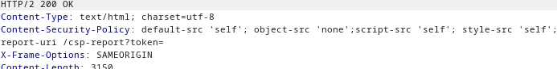
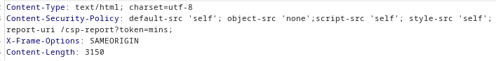

### Reflected XSS protected by CSP, with CSP bypass : EXPERT

---

> See that the respone to searching contains a header field with the CSP.



> This token is user controllable. We can change it by adding to the URL `&token=mins`.



> We know that any scripts we inject will not work due to the CSP implemented as seen in the response headers.
> We can change the CSP since we have some control. We can add a semicolon, and then the `script-src-elem` header with a value of `unsafe-inline` to include our own scripts.
```
<script>alert(1)</script>&token=mins;script-src-elem='unsafe-inline'
```

> We need to encode the angle brackets, brackets, spaces, equal sign, and qoutes.
```
%3Cscript%3Ealert%281%29%3C%2Fscript%3E&token=;script-src-elem%20%27unsafe-inline%27
```

> Paste this payload after `?search=` and complete the lab.

---
