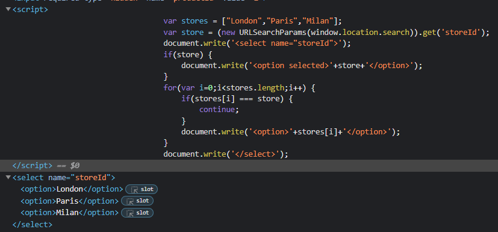
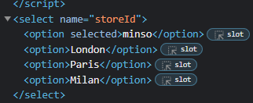
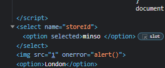

### DOM XSS in document.write sink using source location.search inside a select element : PRACTITIONER

---

> Check the javascript code that works with the storeId.


> This code writes to the document the storeId as an option in the select element.
> Try adding in the URL random text to see how it works.
```
/product?productId=1&storeId=minso
```



> Therefore, we have a source which is the URL query parameter `storeId` and a sink, which is `document.write`.
> There is taint flow, as there is a direct flow of data between these two, and hence, a possible DOM based vulnerability.

> We can try to then input a payload that exits out of the select element and then add an svg with onload, or img with onerror tag that calls the alert function.
```
/product?productId=1&storeId=minso </select> 
```



> And we see the alert pop-up.

---
