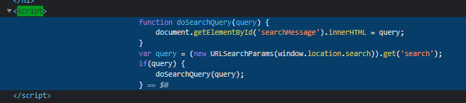
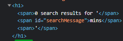
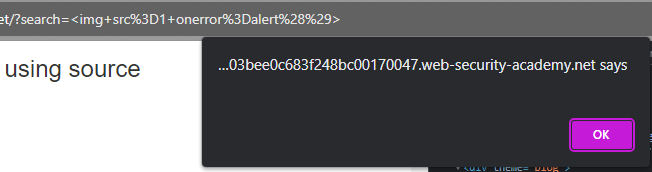
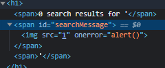

### DOM XSS in innerHTML sink using source location.search : APPRENTICE

---

> Looking for any misconfigured scripts around the application, we see this when we perform a search.



> What this does is that it takes the value of the URL query parameter `search`, and places its value inside the DOM as HTMl in the item with `id=searchMessage`.
> Therefore, we have a source, or the URl we can control, and a sink, which is the `.innerHTML` function.
> We have a taint flow, and hence, a DOM based vulnerability.

> We test by entering a random search string, and seeing that it gets put inside the HTMl element with `id=searchMessage`.




> Since it puts the value inside the HTML tag, then we need to find a payload that will work without having to enter the `script` tags.

```

```

> Putting that payload in the searchbar and searching, we get the pop up.



> We also see in the source code how the HTMl changed.



> It is the same exact code, but instead of the random string, we inserted an HTML element that induces an alert.

---
