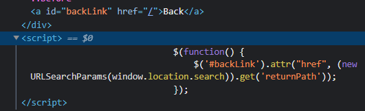
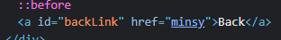
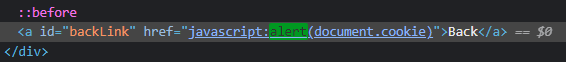

### DOM XSS in jQuery anchor href attribute sink using location.search source : APPRENTICE

---

Go to the submit feedback page, and inspect the page.

Head to the script, and see that it selects the tag with `id=backlink`, and changes its `href` attribute using the `attr` function.



This script goes to the URL, and takes the data after the `returnPath` parameter.
- Try inserting `minsy` string to see what happens



> It changes the `href` attribute to whatever we type.

To execute JavaScript inside the `href` attribute, insert the payload that gets the cookie of the document as needed.
```
javascript:alert(document.cookie)
```



This executes the JavaScript code to create a pop-up with the cookie. 
- It will only pop up if we click on the back button, as the code executes once we click on the backlink button.

---
