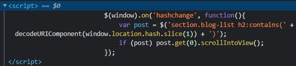

### DOM XSS in jQuery selector sink using a hashchange event : APPRENTICE

---

View the jQuery script in the home page.
- It goes to whatever is after the `#` in the URL.




It is user controllable, so try adding after the URL
```
#
```
- And indeed we get the print function screen.

> To make this exploit delivered to the server, use the exploit server.

Add an `iframe` tag, such that whenever the lab is loaded, the exploit appears without any user interaction.
```
<iframe src ="https://0a0b00b9043b4ccf8331690900400055.web-security-academy.net/#" onload="this.src+=''"></iframe>
```
- An `iframe` is loaded with the URL of the lab that contains the jQuery script that uses the `hashchange` event.
- Once it is loaded, the URL has `#` added.

Since the vulnerable jQuery code executes whatever is after the `#`, the print screen will pop up.


---
