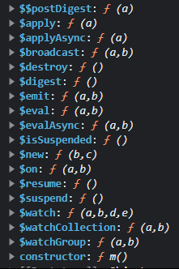

### DOM XSS in AngularJS expression with angle brackets and double quotes HTML-encoded : PRACTITIONER

---

> Realize that the search output is displayed in an `h1` element inside `ng-app`, so there is angularjs being used.
> Try passing `{{ 1 + 1 }}` in the search bar, and see that it is evaluated to 2.

> Try passing `{{ alert(1) }}` in the search bar, but nothing happens.
> So, we should use a property of angular js. This is the constructor function.
> Every function has a constructor function called `constructor` that returns a reference to a function.
> This reference can also be dynamically executed if `()` are put after the reference.

> There are some functions that are in scope that can be used to call the constructor function.
> We can check them out if we enter the developer console and enter
```
angular.element(document.getElementById('academyLabHeader')).scope()
```
>and head down to the prototype section.



> All these functions are in scope. We can use any one of them, and open its constructor built in function.
> This function can be used to create and execute functions.

> So we can say in the search bar
```
{{ $new.constructor('alert()') () }}
```
> This calls the function `alert()` and the `()` in the end are used to execute this function.

> The `$` is used in js libraries and frameworks.

> The alert pop-up shows and the lab is complete.

---
