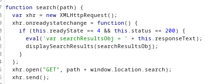
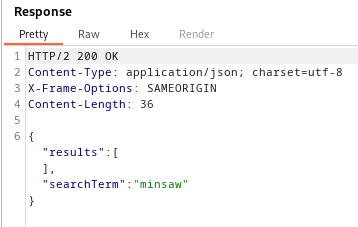

### Reflected DOM XSS : PRACTITIONER

---

Try searching for a random string with BURPSUITE Proxy open and look at the HTTP history.
- See that there is another file containing the JS file script, called `searchResults.js`.



The `eval()` function returns in the response a string.
- This response can be found in the HTTP history tab as one of the different files that come from the server.
- Choose the one whose `GET` request is for `/search-results`.




This string can have a payload inserted that exits out of it, and includes the `alert()` function.
```
search=mins"-alert()
```
- Add the `"` character to break out the string, and the `-alert()` to add the alert() function.
> Use the `-` operation because the `+` operation is the URL encoding of the space, doesn't work as needed.


This doesn't work, as we need to add an escape character before the `"` so as not to be read as double quotes inside the string.
```
search=mins\"-alert()
```

Now, we need to fix the payload as the resulting syntax is incorrect.
- we can do this by adding our own curly braces, and commenting out everything else.
```
search=mins\"-alert()}//
```

> Now the alert pops-up and we complete the lab.

---
