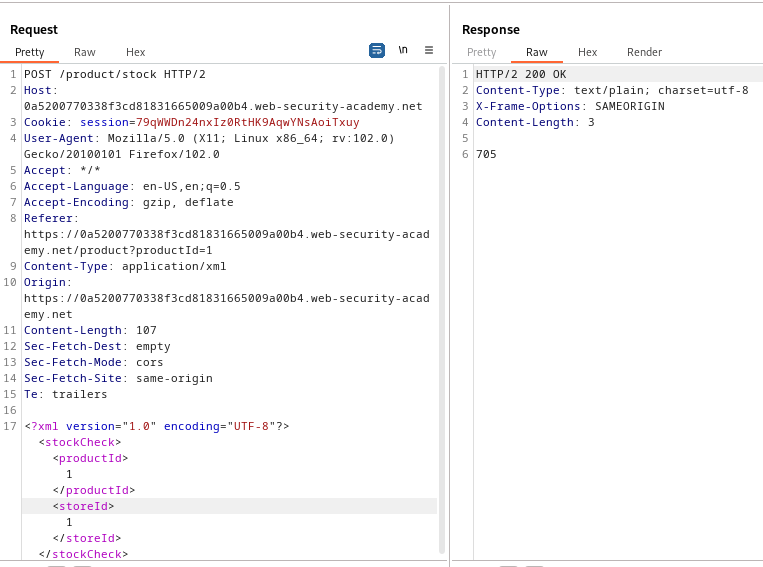
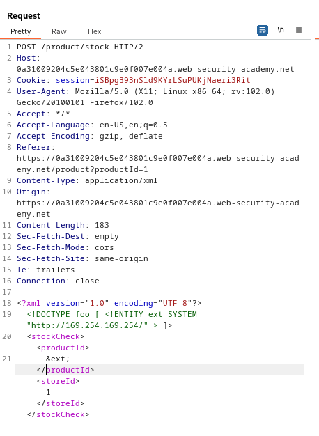
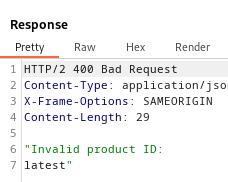
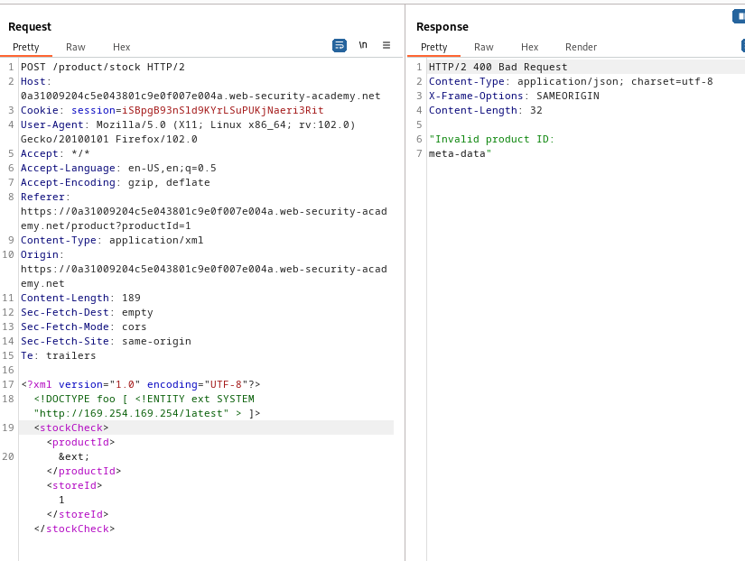
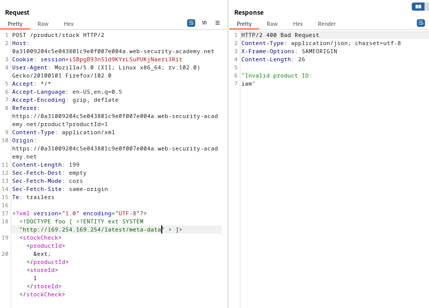
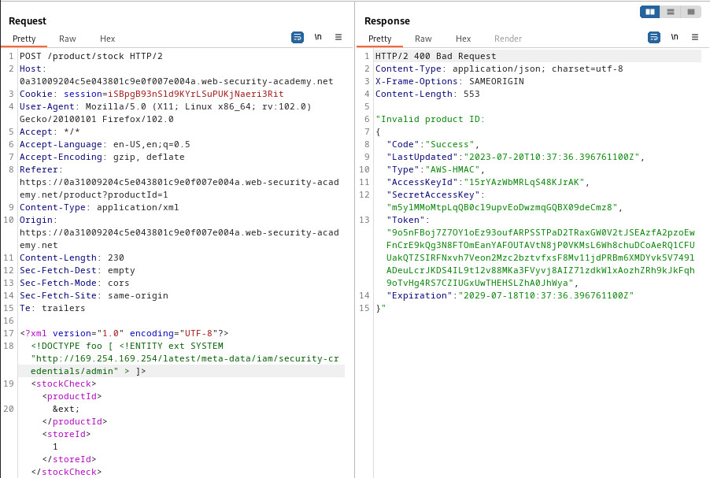

### Exploiting XXE to perform SSRF attacks : APPRENTICE

---


> Viewing any item and then pressing on `check stock` while having BURPSUITE PROXY HTTP history on.


> Viewing the `POST` request sent via HTTP history.



> We see there is XML being used.
> We can add a document that defines an external entity with the path attribute set to the `http://169.254.169.254/` address we need.
> And then call this xml entity to view the results in the application response.

> Edit the `POST` request to add the entity.
```
<!DOCTYPE foo [ <!ENTITY ext SYSTEM "http://169.254.169.254/" > ]>
```

> Then call the entity to view it.
```
&ext;
```



> We see this directory in the response.



> So we modify the link to contain `/latest`.



> We then modify the link to contain `/meta-data`.



> We keep following the directory path until we reach the desired file with the contents we need.



> This completes the lab.

---
