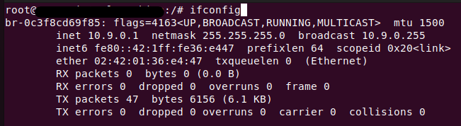

###### [Lab Link](https://seedsecuritylabs.org/Labs_20.04/Networking/Sniffing_Spoofing/) 

---
### Machine Configurations

#### Host M (Attacker)

###### IP : `10.9.0.1`
#### Host A

###### IP : `10.9.0.5`

#### Host B

###### IP : `10.9.0.6`

---

## Task 1: Using Scapy to Sniff and Spoof Packets

> All codes should be run in root privilege as this allows us to spoof packets.

### Task 1.1: Sniffing Packets

First, we need to find the interface to use. This can be done by running the `ifconfig` command. The correct interface to choose is the one with the format `br-xxxxx`.



> We can see that the interface here is: `br-0c3f8cd69f85`.

#### Task 1.1A

We use this code:

```python
from scapy.all import * 

def print_pkt(pkt): 
    pkt.show()
pkt = sniff(iface="br-0c3f8cd69f85", filter="icmp", prn=print_pkt)
```

To observe any packets, we can ping from hostA to hostB, and this code should *sniff* the packets. 

* From hostA, ping hostB IP address.
```bash
ping 10.9.0.6
```

> Run the code on the attacker machine, and see that there are packets being captured.


This packet is headed from hostA to hostB as visible by the IP addresses in the ICMP section. The packet following that will be the ping reply, from hostB to hostA.


> If we try to run as a user other than root, we get an error that we cannot capture any packets. This is because access to the sockets requires root privileges.


#### Task 1.1B

* To capture only the ICMP packet, do the exact same as Task 1.1A

* To capture only TCP packets with a destination port of 23:

```python
from scapy.all import * 

def print_pkt(pkt): 
    pkt.show()

pkt = sniff(iface="br-0c3f8cd69f85", filter="tcp dst port 23", prn=print_pkt)
```

To demonstrate, simply use `telnet` to communicate between hostA and hostB, with username and password `seed:dees`.

* To capture packets going to or from a subnet `128.230.0.0/16`:

```python
from scapy.all import * 

def print_pkt(pkt): 
    pkt.show()

pkt = sniff(iface="br-0c3f8cd69f85", filter="net 128.230.0.0/16", prn=print_pkt)
```

This sets the IP addresses for source/destination to capture packets for from this network range.

### Task 1.2: Spoofing ICMP Packets

To spoof a packet is to send a fake one, we can use scapy to create fake packets:

```python
from scapy.all import * 

a = IP()
a.src='10.9.0.5'
a.dst='10.9.0.6'
b = ICMP()
p = a/b
send(p)
```

This code creates a ping packet with source hostA and destination hostB, but it will be sent from the attacker machine. Opening `tshark`, the terminal version of wireshark, and running this code, we see the following packet:


What happens here is that the packet was sent from the attacker machine hostM, but `tshark` got a spoofed source address, that of hostA.

### Task 1.3: Traceroute

We take from the terminal the user input destination, and this is the destination we find all the hops for.

```python
from scapy.all import *
import sys

# Get the destination IP address from the command line
if len(sys.argv) != 2:
    sys.exit()
dest_ip = sys.argv[1]

# Set the maximum number of hops
max_hops = 30

# Set the initial TTL
ttl = 1

# Repeat the procedure until we reach the destination
while True:
    # Create the packet
    pkt = IP(dst=dest_ip, ttl=ttl) / ICMP()

    # Send the packet and get the response
    res = sr1(pkt, verbose=0)

    # If we get no response, we stop
    if res is None:
        print(ttl, "* * *")
    else:
        print(ttl, res.src)
        if res.src == dest_ip:
            break

    # Increase the TTL
    ttl += 1
    if ttl > max_hops:
        break
```
> What happens here is we create a packet with max hops of 30, such that after 30 hops, we no longer care for the packet.
> We create a packet with the initial `ttl` of 1, and then increment it every time we find a destination after sending the packet using the `sr1` function.

Running this code against `8.8.8.8` for example will return a number of routers equivalent to the number of hops needed for packets to reach this IP address.

---