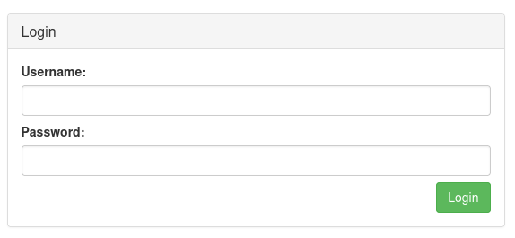

## Flag 1

> Performing DNS enumeration on the given domain using `dnsrecon`.

```
└─$ dnsrecon -d vulnbegin.co.uk
[*] std: Performing General Enumeration against: vulnbegin.co.uk...
[-] DNSSEC is not configured for vulnbegin.co.uk
[*]      SOA ns1.digitalocean.com 173.245.58.51
[*]      SOA ns1.digitalocean.com 2400:cb00:2049:1::adf5:3a33
[*]      NS ns3.digitalocean.com 198.41.222.173
[*]      Bind Version for 198.41.222.173 "2023.9.0"
[*]      NS ns3.digitalocean.com 2400:cb00:2049:1::c629:dead
[*]      NS ns1.digitalocean.com 173.245.58.51
[*]      Bind Version for 173.245.58.51 "2023.9.0"
[*]      NS ns1.digitalocean.com 2400:cb00:2049:1::adf5:3a33
[*]      NS ns2.digitalocean.com 173.245.59.41
[*]      Bind Version for 173.245.59.41 "2023.9.0"
[*]      NS ns2.digitalocean.com 2400:cb00:2049:1::adf5:3b29
[*]      A vulnbegin.co.uk 165.232.97.7
[*]      TXT vulnbegin.co.uk [^FLAG^BED649C4DB2DF265BD29419C13D82117^FLAG^]
[*] Enumerating SRV Records
[-] No SRV Records Found for vulnbegin.co.uk

```

> Gets the first flag.
```
[^FLAG^BED649C4DB2DF265BD29419C13D82117^FLAG^]
```

---
## Flag 2

> Using `subfinder` to enumerate subdomains.

```
subfinder -d vulnbegin.co.uk
```

> Gets 3 subdomains.

```
vulnbegin.co.uk
www.vulnbegin.co.uk
v64hss83.vulnbegin.co.uk
```

> Trying `v64hss83` subdomain, we get the flag.

```
https://v64hss83.jupiter.ctfio.com/

[^FLAG^047524FE61AE6B5FD1D184994C7322FC^FLAG^] 
```

---
## Flag 4

> Check the `robots.txt` directory.

```
https://jupiter.ctfio.com/robots.txt
```

> Found a disallowed directory
```
User-agent: *
Disallow: /secret_d1rect0y/
```

> Accessing that directory gets a flag.

```
https://jupiter.ctfio.com/secret_d1rect0y/

[^FLAG^2B22E2CB70E218510802B0359488F6A2^FLAG^]
```

---
## Flag 5

Performing a fuzzing attack to see if there are any other directories:

```
ffuf -u https://jupiter.ctfio.com/FUZZ -w ./content.txt -t 200
```

> We get this directory: `cpadmin`.

Visiting `https://jupiter.ctfio.com/cpadmin` we are redirected to `https://jupiter.ctfio.com/cpadmin/login`.



> Trying a few combinations, it seems that it tells us when the username is invalid and when the password is invalid. 
>  This calls for a brute force attack first on the username to find the right username, and then a brute force attack on the password to find the correct combination.

Using portswigger intruder with a sniper attack to brute force the username, we get that `admin` gets us the only response that has `invalid password`, meaning that the username is correct but the password is not correct. 

Now, we brute force for the password with the `admin` username until it works, this can be seen from the response with a different size than all others.
- We get the password `159753` that works.

We get the flag: 
```
[^FLAG^93D7491FB4B054FB5C5AC3E0292BE41C^FLAG^]
```

---
