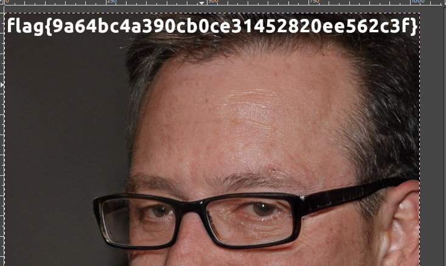

> Download the file and use the `exiftool` to see its type.

```
exiftool layered_security

ExifTool Version Number         : 12.67
File Name                       : layered_security
Directory                       : .
File Size                       : 31 MB
File Modification Date/Time     : 2023:10:20 04:43:31-04:00
File Access Date/Time           : 2023:10:20 04:43:47-04:00
File Inode Change Date/Time     : 2023:10:20 04:43:43-04:00
File Permissions                : -rw-r--r--
File Type                       : XCF
File Type Extension             : xcf
MIME Type                       : image/x-xcf
XCF Version                     : 11
Image Width                     : 1024
Image Height                    : 1024
Color Mode                      : RGB Color
Compression                     : RLE Encoding
X Resolution                    : 300
Y Resolution                    : 300
Tattoo                          : 18
Units                           : Inches
Comment                         : Created with GIMP
Image Size                      : 1024x1024
Megapixels                      : 1.0
```

> `xcf` image.
> Quick google search says i can open this file type using `gimp`.

```
sudo apt-get install gimp
```

> Then opening the file with gimp.

```
gimp layered_security
```

> We see there are many layers of pictures.
> Removing layer 9 by clicking on the eye button, we see another image.
> Keep removing layers sequentiall until we see in layer 3 the flag at the top of the image.



```
flag{9a64bc4a390cb0ce31452820ee562c3f}
```

---
