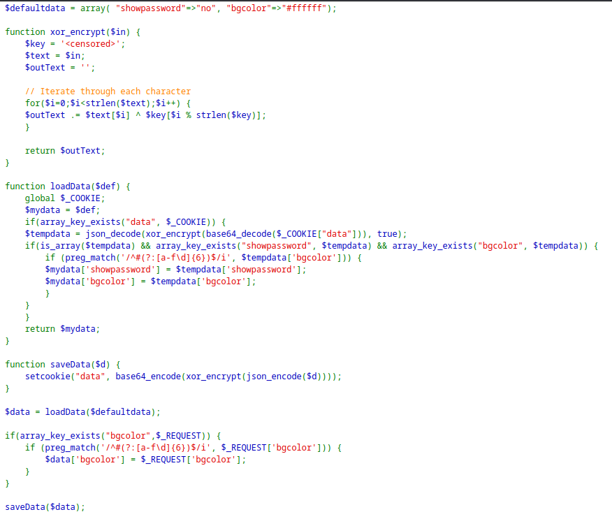
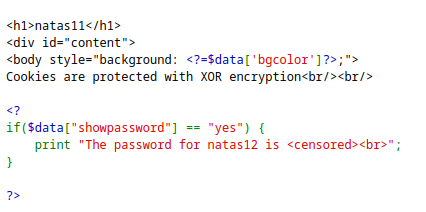
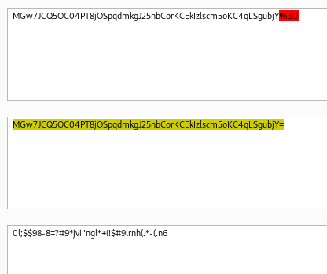

> Checking the source code.



> We see there are 3 functions, and an array.

1. `xor_encrypt`: This function takes an input plain text, and then uses a hidden key (we should find it) to `xor` it with the plain text to produce cypher text.
2. `load_data`: This function loads the value of the `data` cookie and decodes it using `base64_decode`, then `xor_encrypt`, then `json_decode`.
3. `store_data`: This function stores data inside the `data` cookie by encoding the data in the opposite direction.
4. The `defaultdata` array contains 2 elements, and we want to change the value of the first element `showpassword` to `yes` as this will show the password.



> The first thing being done is decoding and loading the contents of the cookie into the variable `data`, and then the contents of this variable are encoded and stored again into the `data` cookie.
> Notice that the plain text here is the contents of the array `defaultdata`.

> Basically the point is to be able to decode and encode our own data to store into the `data` cookie. To do that, we need to discover the secret key of the `xor_encrypt` function.

###### Directions of decoding and encoding.
> We have the plain text, it becomes the cookie if we first json encode it, then xor encrypt it, then base64 encode it.
> We have the cookie, it becomes the plain text if we base64 decode it, then xor encrpyt it, then json decode it.

> We can only complete the first steps of both directions, but realize that the first step of one direction is the last step of the other direction.
> The middle step is the only step we can't recreate since we don't have the `xor` key.

###### Process
> We proceed as follows:

1. `base64` decode the cookie. This will get us the content right before `xor_encrypt`.



> We first have to URL decode the cookie.
```
0l;$$98-8=?#9*jvi 'ngl*+(!$#9lrnh(.*-(.n6
```

2. `json_encode` the plain text. This will get us the content right after `xor_encrypt`.

```php
<?
$defaultdata = array("showpassword" => "no", "bgcolor" => "#ffffff");
echo json_encode($defaultdata);
?>

// output: {"showpassword":"no","bgcolor":"#ffffff"}
```

3. If we have both input and output of the `xor_encrypt` function, we can get the key. (we have 2 out of 3 variables in the equation).
	* If we have any 2 variables in an `xor` equation of 3 variables, we can get the third by `xor`ing the 2 we have.
```php
<?
$defaultdata = array("showpassword" => "no", "bgcolor" => "#ffffff");

$before = "0l;$$98-8=?#9*jvi 'ngl*+(!$#9lrnh(.*-(.n6";
$after = json_encode($defaultdata);

$key = $before ^ $after;
echo $key;
?>

// output: KNHLKNHLKNHLKNHLKNHLKNHLKNHLKNHLKNHLKNHLK
```

> We get the key to be a repeating string of `KNHL`, based on online sources and the `xor` encryption technique, this is the key.

> Now, we can recreate the encoding process to create our own cookie.

1. Get the plain text we want to encode: 
```
array("showpassword" => "yes", "bgcolor" => "#ffffff");
```
2. `json_encode` it: 
```
{"showpassword":"yes","bgcolor":"#ffffff"}
```
3. `xor_encrypt` it using our key: 
```php
// {"showpassword":"yes","bgcolor":"#ffffff"} ^ KNHL
<?
$defaultdata = array("showpassword" => "yes", "bgcolor" => "#ffffff");

function xor_encrypt($in)
{
    $key = 'KNHL';
    $text = $in;
    $outText = '';
    // Iterate through each character
    for ($i = 0; $i < strlen($text); $i++) {
        $outText .= $text[$i] ^ $key[$i % strlen($key)];
    }
    return $outText;
}

$x = json_encode($defaultdata);
$result = xor_encrypt($x);

echo $result;
?>

//output: 0l;$$98-8=?#9*jvi7-?ibj.,-' $<jvim.*-(.*i3
```
4. `base64_encode` the output.
```
MGw7JCQ5OC04PT8jOSpqdmk3LT9pYmouLC0nICQ8anZpbS4qLSguKmkz
```

> Now just change the value of the `data` cookie to that through the developer tools and refresh the page to see the password for the next level.

```
natas12:YWqo0pjpcXzSIl5NMAVxg12QxeC1w9QG
```

---
